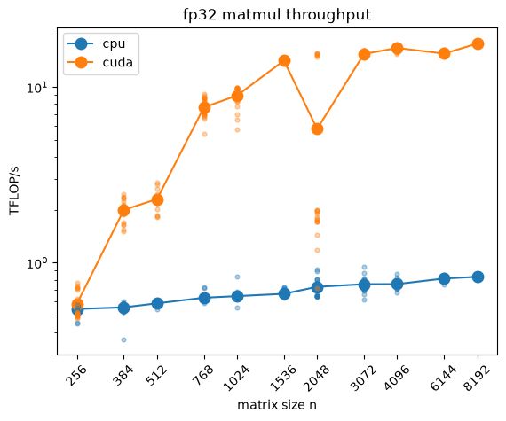

# Hardware detection & verification

**Objective.** Characterize the compute available on this machine, verify
that torch drives it correctly, and quantify delivered matmul throughput.


```python
import platform
import time

import matplotlib.pyplot as plt
import torch

torch.manual_seed(0)

print(f"{platform.platform()=}")
print(f"{platform.python_version()=}")
print(f"{torch.__version__=}")
print(f"{torch.initial_seed()=}")
```

    platform.platform()='Linux-6.18.33.1-microsoft-standard-WSL2-x86_64-with-glibc2.43'
    platform.python_version()='3.12.13'
    torch.__version__='2.12.1+cu130'
    torch.initial_seed()=0


```python
print(f"{torch.backends.cuda.is_built()=}")
print(f"{torch.cuda.is_available()=}")
if torch.cuda.is_available():
    print(f"{torch.version.cuda=}")
    print(f"{torch.cuda.device_count()=}")
```

    torch.backends.cuda.is_built()=True
    torch.cuda.is_available()=True
    torch.version.cuda='13.0'
    torch.cuda.device_count()=1


**[C] Additional CUDA diagnostic details.** Compute capability determines
the dtype regime: bf16 and TF32 (tensor-core float32 matmuls) require
Ampere (8.0+). TF32 capability is a hardware fact; whether matmuls use it
is a runtime switch (`torch.backends.cuda.matmul.allow_tf32`, off by
default since torch 1.12). Both are recorded; [E] measures the accuracy
consequence of the switch.


```python
if torch.cuda.is_available():
    props = torch.cuda.get_device_properties(0)
    cc = (props.major, props.minor)
    print(f"{props.name=}")
    print(f"{props.total_memory / 2**30=:.1f} GiB")
    print(f"{cc=}")
    print(f"{props.multi_processor_count=}")
    print(f"{torch.cuda.is_bf16_supported()=}")
    print(f"{cc >= (8, 0)=}  # tf32 capable")
    print(f"{torch.backends.cuda.matmul.allow_tf32=}")
```

    props.name='NVIDIA GeForce RTX 5060 Ti'
    props.total_memory / 2**30=15.9 GiB
    cc=(12, 0)
    props.multi_processor_count=36
    torch.cuda.is_bf16_supported()=True
    cc >= (8, 0)=True  # tf32 capable
    torch.backends.cuda.matmul.allow_tf32=False


**[D] `get_device()`.** Selects the best available backend (cuda, else cpu).
The `override` flag exists for benchmarking: comparing backends requires
pinning each side explicitly ([F] uses it for the CPU baseline).

TODO: graduate to `tinyterp/device.py`.


```python
def get_device(override: str | None = None) -> torch.device:
    """Best available backend (cuda > cpu), or exactly `override`."""
    if override is not None:
        return torch.device(override)
    if torch.cuda.is_available():
        return torch.device("cuda")
    return torch.device("cpu")


device = get_device()
print(f"{device=}")
print(f"{get_device('cpu')=}")
```

    device=device(type='cuda')
    get_device('cpu')=device(type='cpu')


**[E] Correctness & precision test.** Verifies the selected device computes
correctly, not merely without error.

Method: worst max-abs-diff between device and CPU matmuls (n=256) across
five trials, measured in fp32 and again with TF32 forced on, to establish
the pass threshold empirically rather than assume one.

Results (RTX 5060 Ti): fp32 accumulation-order noise ~3e-5, consistent with
the estimate √K·ε·|element| ≈ 16·1.2e-7·16 for K=256; TF32 error (~10-bit
mantissa) ~3e-2. The fp32 imprecision arises because floating-point
addition is not associative: every partial sum rounds to the nearest
representable value, so the blocked/parallel reduction order cuBLAS uses
accumulates different rounding errors than CPU BLAS, growing roughly with
√K for random data. To learn more: Goldberg, "What Every Computer Scientist
Should Know About Floating-Point Arithmetic"
(https://docs.oracle.com/cd/E19957-01/806-3568/ncg_goldberg.html), and
NVIDIA, "Floating Point and IEEE 754"
(https://docs.nvidia.com/cuda/floating-point/).

The two regimes are three orders of magnitude apart, so a 1e-4 threshold
accepts fp32 noise while rejecting a silent TF32 downgrade and outright
breakage (O(1)). `allclose` defaults are unsuitable here: near-zero output
elements fall back on `atol=1e-8`, which trips on ordinary fp32 noise.


```python
def max_matmul_diff(trials: int = 5, n: int = 256) -> float:
    """Worst max-abs-diff between device and CPU matmul across trials."""
    worst = 0.0
    for _ in range(trials):
        a, b = torch.randn(n, n), torch.randn(n, n)
        diff = (a @ b - (a.to(device) @ b.to(device)).cpu()).abs().max().item()
        worst = max(worst, diff)
    return worst


fp32_diff = max_matmul_diff()
print(f"{fp32_diff=:.2e}")

if device.type == "cuda":
    torch.backends.cuda.matmul.allow_tf32 = True
    tf32_diff = max_matmul_diff()
    print(f"{tf32_diff=:.2e}")
    torch.backends.cuda.matmul.allow_tf32 = False

assert fp32_diff < 1e-4, "device result diverges from CPU beyond fp32 noise"
print(f"matmul on {device} matches CPU within fp32 tolerance (1e-4)")
```

    fp32_diff=2.86e-05
    tf32_diff=2.40e-02
    matmul on cuda matches CPU within fp32 tolerance (1e-4)


**[F] Matmul throughput benchmark.** An n×n matmul costs 2n³ FLOPs; timing
across sizes yields TFLOP/s per backend.

Protocol: a warmup matmul absorbs one-time JIT and allocation costs;
`torch.cuda.synchronize()` brackets the timed region (launches are async, so
an unsynchronized clock times the launch rather than the work); tensors are
created on-device so compute is measured, not PCIe transfer. All samples are
plotted (small dots) with the per-size mean (large point). Min/max error
bars were evaluated and rejected: a size's reps run back-to-back in a ~1–2 s
window and share the prevailing GPU state, so per-size spread reflects
short-term jitter only, not run-to-run variance.

Note: Observed a recurring ~3× throughput dip at n=2048 in some runs,
absent in others. Not a size effect: the sweep's timing is deterministic, so
a periodic external GPU load (the WDDM scheduler time-slices this GPU
between CUDA and the Windows desktop under WSL2; VS Code renders through it)
lands at the same offset, hence the same size, each run. The sample
distribution disambiguates: uniformly slow reps indicate a sustained
contention window; a bimodal split indicates sporadic preemption. An
interleaved (size, rep) sweep would smear temporal effects into noise;
judged unnecessary here.

Results (fp32): CPU plateaus near 1 TFLOP/s across the sweep; the RTX 5060
Ti climbs steeply to n≈1536 and flattens at 15–18 TFLOP/s (~20× once
saturated). At n=256 the backends are nearly tied: launch overhead swamps
the ~33 μs of GPU work, so small workloads do not automatically win on GPU.


```python
def matmul_tflops(dev: torch.device, n: int, reps: int = 20) -> list[float]:
    """Per-rep throughputs of an n×n fp32 matmul on `dev`, in TFLOP/s."""
    a = torch.randn(n, n, device=dev)
    b = torch.randn(n, n, device=dev)
    a @ b  # warmup: JIT/alloc costs land here, not on the clock
    samples = []
    for _ in range(reps):
        if dev.type == "cuda":
            torch.cuda.synchronize()
        t0 = time.perf_counter()
        a @ b
        if dev.type == "cuda":
            torch.cuda.synchronize()
        samples.append(2 * n**3 / (time.perf_counter() - t0) / 1e12)
    return samples


sizes = [256, 384, 512, 768, 1024, 1536, 2048, 3072, 4096, 6144, 8192]
backends = ["cpu"] if device.type == "cpu" else ["cpu", device.type]
results = {be: [matmul_tflops(get_device(be), n) for n in sizes] for be in backends}

for be in backends:
    means = [sum(s) / len(s) for s in results[be]]
    print(f"{be:>4}: " + "  ".join(f"n={n}: {m:7.3f}" for n, m in zip(sizes, means)))

fig, ax = plt.subplots()
for be in backends:
    means = [sum(s) / len(s) for s in results[be]]
    line, = ax.plot(sizes, means, marker="o", markersize=9, label=be)
    for n, s in zip(sizes, results[be]):
        ax.scatter([n] * len(s), s, s=12, alpha=0.35, color=line.get_color(), zorder=3)
ax.set(xlabel="matrix size n", ylabel="TFLOP/s", title="fp32 matmul throughput",
       xscale="log", yscale="log")
ax.set_xticks(sizes, labels=[str(n) for n in sizes], rotation=45, minor=False)
ax.xaxis.set_minor_locator(plt.NullLocator())  # default log ticks would clutter
ax.legend()
plt.show()
```

     cpu: n=256:   0.545  n=384:   0.556  n=512:   0.586  n=768:   0.631  n=1024:   0.645  n=1536:   0.665  n=2048:   0.728  n=3072:   0.754  n=4096:   0.755  n=6144:   0.812  n=8192:   0.831
    cuda: n=256:   0.584  n=384:   1.996  n=512:   2.301  n=768:   7.657  n=1024:   8.954  n=1536:  14.149  n=2048:   5.778  n=3072:  15.431  n=4096:  16.699  n=6144:  15.503  n=8192:  17.685


    

    

