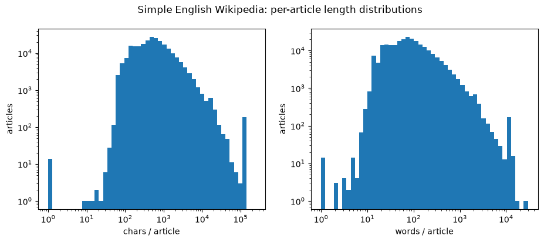

# Training data acquisition: Simple English Wikipedia

**Objective.** Pull a raw-text training corpus from HuggingFace, verify it
lands in the shared cache (persisting nothing in the worktree), and
characterize it as text. Tokenization is deferred to its own notebook; this
stops at the word boundary.

**[A] Load.** `wikimedia/wikipedia` is the current canonical Wikipedia export
on HuggingFace (the older `wikipedia` dataset is deprecated and requires
`apache-beam` to build from raw dumps); config `20231101.simple` is the
Simple English wiki as of that dump date, pre-cleaned to one article per row
with wikitext markup already stripped. Full download, not streaming: the
corpus is small enough (hundreds of MB) to characterize in full, and later
cells need global passes (a corpus-wide word count) that streaming cannot
random-access.

The download lands in the shared HuggingFace cache
(`~/.cache/huggingface/datasets`), not the worktree. `$HOME` is common across
all worktrees, so the first pull populates the cache and every other worktree
hits it for free: acquisition persists nothing local. `HF_DATASETS_CACHE` is
printed to make that concrete.

```python
import datasets
from datasets import load_dataset

ds = load_dataset("wikimedia/wikipedia", "20231101.simple")

print(f"{datasets.config.HF_DATASETS_CACHE=}")
print(f"{ds=}")
articles = ds["train"]
print(f"{len(articles)=}")
```

```
/home/trironkk/agent-worktrees/github.com/trironkk/tinyterp/a02/.venv/lib/python3.12/site-packages/tqdm/auto.py:21: TqdmWarning: IProgress not found. Please update jupyter and ipywidgets. See https://ipywidgets.readthedocs.io/en/stable/user_install.html
  from .autonotebook import tqdm as notebook_tqdm


Warning: You are sending unauthenticated requests to the HF Hub. Please set a HF_TOKEN to enable higher rate limits and faster downloads.


datasets.config.HF_DATASETS_CACHE=PosixPath('/home/trironkk/.cache/huggingface/datasets')
ds=DatasetDict({
    train: Dataset({
        features: ['id', 'url', 'title', 'text'],
        num_rows: 241787
    })
})
len(articles)=241787
```

**[B] Schema & scale.** All four columns are plain strings: `id`, `url`,
`title`, `text`. Only `text` (and to a lesser extent `title`) is training
material; `id`/`url` are provenance the training pipeline will drop.

Two sizes are worth separating. `download_size` is the compressed parquet
actually fetched over the network (~150 MiB); `dataset_size` is the
uncompressed Arrow the loader materializes and memory-maps (~278 MiB, one
shard). The ~1.9x gap is parquet's columnar compression on natural-language
text. Both live under the shared cache, so the 278 MiB is paid once per
machine, not once per worktree.

```python
n = len(articles)
print(f"{articles.features=}")
print(f"{n=}")
print(f"{articles.info.download_size / 2**20=:.1f}")  # MiB, compressed parquet
print(f"{articles.info.dataset_size / 2**20=:.1f}")  # MiB, uncompressed arrow
print(f"{articles.cache_files=}")
```

```
articles.features={'id': Value('string'), 'url': Value('string'), 'title': Value('string'), 'text': Value('string')}
n=241787
articles.info.download_size / 2**20=149.6
articles.info.dataset_size / 2**20=277.8
articles.cache_files=[{'filename': '/home/trironkk/.cache/huggingface/datasets/wikimedia___wikipedia/20231101.simple/0.0.0/b04c8d1ceb2f5cd4588862100d08de323dccfbaa/wikipedia-train.arrow'}]
```

**[C] Peek.** Make the corpus tangible: this string content is exactly what a
tokenizer will later see. Two articles bracket the range, a long one (`April`,
~16k chars) and a short one (`Dublin`, ~1k), each shown as a head snippet plus
metadata.

Caveat surfaced here: the "pre-cleaned" claim holds for prose but not for
tables. Article bodies drawn from infoboxes or statistics tables retain raw
wikitext:

- `rowspan`, `colspan`: table cell-span attributes.
- `|-`: table row separators.
- `Hans-Jörg Butt` (idx 50000): an article that is largely a career-stats
  table rather than prose.

Prose-only filtering is therefore a real downstream concern, not assumed away
by the source.

```python
def show(idx: int, head: int = 600) -> None:
    """Print one article's metadata and a head snippet of its text."""
    a = articles[idx]
    print(f"--- idx={idx} chars={len(a['text'])} ---")
    print(f"{list(a.keys())=}")
    print(f"{a['id']=}")
    print(f"{a['url']=}")
    print(f"{a['title']=}")
    print(f"{a['text'][:head] + ('...' if len(a['text']) > head else '')=}")
    print()


show(0)
show(100)
```

```
--- idx=0 chars=16109 ---
list(a.keys())=['id', 'url', 'title', 'text']
a['id']='1'
a['url']='https://simple.wikipedia.org/wiki/April'
a['title']='April'
a['text'][:head] + ('...' if len(a['text']) > head else '')='April (Apr.) is the fourth month of the year in the Julian and Gregorian calendars, and comes between March and May. It is one of the four months to have 30 days.\n\nApril always begins on the same day of the week as July, and additionally, January in leap years. April always ends on the same day of the week as December.\n\nThe Month \n\nApril comes between March and May, making it the fourth month of the year. It also comes first in the year out of the four months that have 30 days, as June, September and November are later in the year.\n\nApril begins on the same day of the week as July every year a...'

--- idx=100 chars=972 ---
list(a.keys())=['id', 'url', 'title', 'text']
a['id']='186'
a['url']='https://simple.wikipedia.org/wiki/Dublin'
a['title']='Dublin'
a['text'][:head] + ('...' if len(a['text']) > head else '')="Dublin () is the capital of the Republic of Ireland, and the biggest city on the island of Ireland. In 2011, there were over 1.1 million people living in the Greater Dublin Area.\n\nDublin was built by the Vikings upon the river Liffey. The river divides the city into two parts, North Dublin and South Dublin.\n\nMany famous writers lived in Dublin. Oscar Wilde and George Bernard Shaw were born in Dublin. James Joyce is probably Dublin's best known and most international writer.\n\nDublin is home to Ireland's largest stadium for all sports, Croke Park. It can hold up to 85,000 people. Croke Park is t..."
```

**[D] Characterize.** Per-article size in two units: raw character length and
word count. "Word" is fixed here for the whole notebook as a lowercased run of
Unicode letters (`\p{L}+`), so case folds together and punctuation, digits,
and apostrophe/hyphen boundaries split (`don't` becomes `don`, `t`). This
single definition is reused by [E]; alternatives (keeping digits, keeping
intra-word apostrophes) were rejected to keep the vocabulary purely lexical.

Method: one pass building both per-article lists, then percentile summaries
and histograms. The word pass runs the regex over ~267M characters and takes
a few seconds; the char pass is trivial.

Results: both distributions are heavily right-skewed. Median article is 514
chars / 76 words but the mean is 1106 / 164, pulled up by a long tail topping
out near 237k chars (29.5k words). A stub tail sits at the other end (min 1
char). Log-spaced bins with log-log axes render both tails; linear bins
collapse nearly all mass into the first bucket. Totals across 241,787
articles: ~267M characters, ~39.7M words, the corpus scale later token-budget
planning starts from.

```python
import numpy as np
import regex as re
import matplotlib.pyplot as plt

WORD = re.compile(r"\p{L}+")


def words(text: str) -> list[str]:
    """Lowercased Unicode-letter runs: the notebook's single 'word' definition."""
    return WORD.findall(text.lower())


texts = articles["text"]
char_lens = [len(t) for t in texts]
word_counts = [len(words(t)) for t in texts]


def summary(name: str, xs: list[int]) -> None:
    """Print min, median, mean, p90, p99, max for a length series."""
    s = sorted(xs)
    n = len(s)
    q = lambda p: s[int(p * (n - 1))]
    print(f"{name}: min={s[0]} p50={q(.5)} mean={sum(xs) // n} p90={q(.9)} p99={q(.99)} max={s[-1]}")


summary("chars", char_lens)
summary("words", word_counts)
print(f"{sum(char_lens)=}")
print(f"{sum(word_counts)=}")

fig, axes = plt.subplots(1, 2, figsize=(11, 4))
for ax, (label, xs) in zip(axes, [("chars / article", char_lens), ("words / article", word_counts)]):
    bins = np.logspace(0, np.log10(max(xs)), 50)
    ax.hist(xs, bins=bins)
    ax.set(xlabel=label, ylabel="articles", xscale="log", yscale="log")
fig.suptitle("Simple English Wikipedia: per-article length distributions")
plt.show()
```

```
chars: min=1 p50=514 mean=1106 p90=2069 p99=9490 max=236695
words: min=1 p50=76 mean=163 p90=323 p99=1510 max=29507
sum(char_lens)=267477061
sum(word_counts)=39651554
```



**[E] Word frequency by length.** Corpus vocabulary: total token count, unique
type count, and the five commonest words of each character length. Reuses
[D]'s `words()`, so the total here must equal [D]'s per-article word sum, a
built-in consistency check across the two independent passes.

Method: one global `Counter` over the letter-tokens, then bucket the frequency
ranking by word length and keep the top five per bucket. Lengths 1 to 20 are
printed; the observed max length is 85, a tail of concatenated artifacts not
worth showing.

Results: 39,651,554 tokens (matching [D]) across 592,840 unique types. Short
buckets are the expected Zipf function words (`the`, `of`, `in`, `and`). The
per-length view's real payoff is quantifying the table-markup contamination
[C] flagged: tokens that rank among the commonest of their length yet are not
article prose at all.

- `right` (195k), `align` (188k), `bgcolor` (186k): wikitext table-cell
  attributes.
- `fefefe` (70k): the hex color `#FEFEFE`, a table-cell background fill.
- `references` (157k): a section header, not body text.
- `establishments`, `politicians`, `footballers`: category-suffix plurals from
  Wikipedia's stub boilerplate.

Conclusion: raw dumps plus a letter-only split yield a vocabulary whose head is
partly structural, reinforcing that prose extraction and filtering are
prerequisites for a clean training corpus, not optional polish.

```python
from collections import Counter, defaultdict

vocab = Counter()
for t in texts:
    vocab.update(words(t))

print(f"{sum(vocab.values())=}")
print(f"{len(vocab)=}")

by_len: dict[int, list[tuple[str, int]]] = defaultdict(list)
for w, k in vocab.most_common():
    if len(by_len[len(w)]) < 5:
        by_len[len(w)].append((w, k))

for length in range(1, 21):
    row = by_len.get(length, [])
    print(f"len {length:2d}: " + "  ".join(f"{w}({k})" for w, k in row))
```

```
sum(vocab.values())=39651554
len(vocab)=592840
len  1: a(785804)  s(263182)  e(209395)  d(197343)  b(51115)
len  2: of(1210968)  in(1140461)  is(602051)  to(553218)  it(282505)
len  3: the(2313557)  and(899242)  was(455950)  for(262165)  are(161608)
len  4: from(269333)  with(176625)  that(172556)  they(109122)  this(100499)
len  5: right(195106)  align(188397)  other(125851)  first(82761)  which(76273)
len  6: people(139434)  linear(97223)  united(84835)  states(73567)  fefefe(69639)
len  7: bgcolor(186149)  socorro(96520)  october(49118)  january(45233)  english(39210)
len  8: american(148880)  websites(68919)  national(43846)  december(40443)  november(40177)
len  9: september(57731)  president(27581)  different(22082)  including(16120)  australia(14747)
len 10: references(156760)  television(42632)  university(31476)  politician(26072)  department(22729)
len 11: politicians(16378)  association(9911)  footballers(9348)  switzerland(7297)  information(7061)
len 12: municipality(15344)  championship(11500)  professional(10674)  sportspeople(8049)  pennsylvania(4968)
len 13: international(21421)  massachusetts(5087)  entertainment(4755)  championships(4160)  organizations(3535)
len 14: establishments(23163)  municipalities(9307)  businesspeople(3604)  arrondissement(3433)  administrative(3221)
len 15: representatives(5630)  arrondissements(1842)  characteristics(987)  internationally(655)  philanthropists(488)
len 16: intercontinental(388)  supercentenarian(363)  environmentalist(188)  responsibilities(185)  unconstitutional(172)
len 17: disestablishments(3168)  environmentalists(216)  supercentenarians(123)  interdisciplinary(94)  industrialization(89)
len 18: telecommunications(353)  thiruvananthapuram(77)  australopithecines(50)  epsubpageextractor(44)  hydroxychloroquine(32)
len 19: missthailandcontest(33)  passeriformesfamily(29)  carcharodontosaurus(28)  counterintelligence(22)  globalsportsarchive(17)
len 20: hypercholesterolemia(11)  acetylcholinesterase(11)  tetrahydrocannabinol(10)  jugendliteraturpreis(9)  internationalization(8)
```

## TODO: other datasets to explore

Simple English Wikipedia is the starting corpus; candidates for future
acquisition notebooks, roughly ordered small to large:

- **`tiny_shakespeare`**: ~1 MB, a single character stream; the nanoGPT
  staple, aligned with the Karpathy zero-to-hero track and trainable in
  seconds for quick end-to-end loops.
- **`roneneldan/TinyStories`**: synthetic simple-English stories crafted so a
  very small model still produces coherent text, well suited to
  interpretability toys where the model must be tractable.
- **`Salesforce/wikitext` (`wikitext-103-raw-v1`)**: the standard word-level
  language-modeling benchmark, useful for checking perplexity against
  published numbers.
- **`wikimedia/wikipedia` (`20231101.en`)**: same loader and schema as this
  notebook, roughly 40x larger, for when scale rather than iteration speed is
  the point.
- **`HuggingFaceFW/fineweb-edu`**: large-scale filtered web text, the
  realistic pretraining corpus to graduate to once the pipeline (including the
  prose extraction motivated above) is solid.
