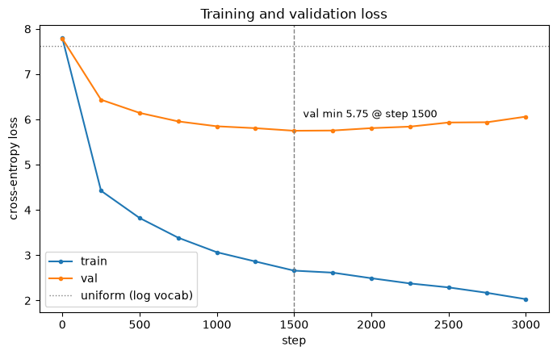
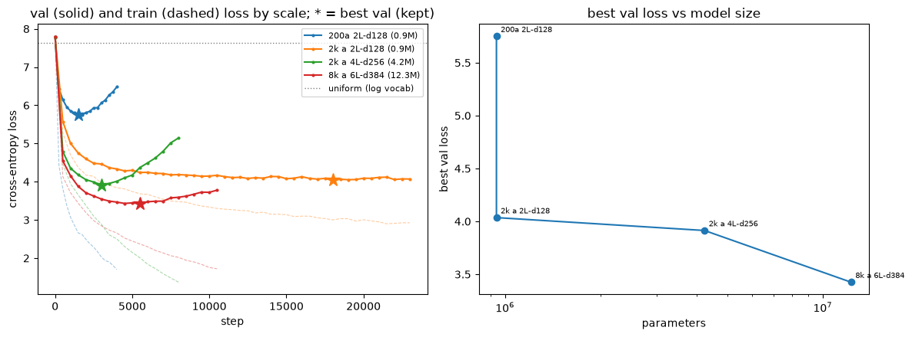
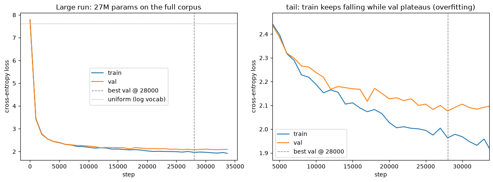

# Decoder-only transformer: forward pass, then trained on Simple Wiki

**Objective.**

- Build a decoder-only transformer forward pass from token ids to next-token logits.
- Verify the plumbing: shapes, parameter count, causality, a valid softmax.
- Train it on a sample of Simple English Wikipedia to confirm the wiring learns (train and val
  loss both fall, sampling yields recognizably English-ish text).
- Tokens come from the byte-level BPE tokenizer trained in notebooks/2026-07-05_tokenization.py
  (vocab 2048), now graduated to `tinyterp.tokenizer` and loaded from the shared cache.

**Architecture and data flow.** Bracketed labels point to the cell that builds each piece.

Assembly and plumbing live in [B]; attention (the one non-trivial forward) in [C].

```
input  [B, T]   (token ids)
   |
   |  token embedding       (vocab    -> d_model)   \
   |  positional embedding  (position -> d_model)    |  [B]
   |         (summed)                               /
   v
 residual stream  x  [B, T, d_model]
   |
   |   x N decoder blocks ....................................... [B]
   |   +--------------------------------------------------+
   +-->|  x = x + Attn(LayerNorm(x))   mix across positions  <- [C]
   |   |  x = x + MLP(LayerNorm(x))    mix across features   <- [B]
   |   +--------------------------------------------------+
   v
 final LayerNorm
   |
   |  unembed               (d_model  -> vocab)         [B]
   v
 logits  [B, T, vocab]  ->  next-token distribution at each position
```

The residual stream is the backbone: embeddings write into it, each block reads from it and adds
its result back (never overwrites), and the unembed reads the final state. Attention moves
information across positions; the MLP transforms each position independently.

**[A] Setup.**

- Prefer the persisted tokenizer over retraining: the vocab/merges were learned in the
  tokenization notebook and cached on disk.
- Artifacts live in a shared cache outside the worktree (`tinyterp.cache_path`, resolving under
  $TINYTERP_CACHE_DIR, else $XDG_CACHE_HOME/tinyterp, else ~/.cache/tinyterp), so every worktree
  on the machine reuses the same trained tokenizer instead of each re-paying the roughly 12
  minute training.
- The tokenizer has graduated to `tinyterp.tokenizer`, so everything is imported from the
  package rather than re-inlined; `get_device` comes from the same package.
- Greedy tokenization depends only on the vocab, not the merge order, so the loaded vocab alone
  suffices to encode and decode.
- "Load, don't retrain" is guarded, not assumed: if the cached tokenizer is absent the full
  corpus is tokenized with `train_bpe_incremental` (the minutes of work the cache exists to
  avoid) and saved back to the shared cache.

```python
from tinyterp import (
    cache_path,
    config_hash,
    decode,
    encode,
    get_device,
    load_tokenizer,
    save_tokenizer,
    train_bpe_incremental,
)

VOCAB_SIZE = 2048
tokenizer_path = cache_path(f"tokenizer_simplewiki_v{VOCAB_SIZE}.pkl")

if tokenizer_path.exists():
    vocab, merges = load_tokenizer(tokenizer_path)
else:
    from datasets import load_dataset

    articles = load_dataset("wikimedia/wikipedia", "20231101.simple")["train"]
    full_text = "\n\n".join(articles["text"])
    vocab, merges = train_bpe_incremental(full_text, VOCAB_SIZE)
    save_tokenizer(tokenizer_path, vocab, merges)
print(f"{tokenizer_path.exists()=}")

device = get_device()
sample = "The transformer reads Simple English Wikipedia."
sample_ids = encode(sample, vocab)
round_trip = decode(sample_ids, vocab)
print(f"{device=}")
print(f"{len(vocab)=}")
print(f"{sample_ids=}")
print(f"{round_trip=}")
assert round_trip == sample
```

```
tokenizer_path.exists()=True
device=device(type='cuda')
len(vocab)=2048
sample_ids=[443, 1407, 953, 260, 349, 327, 115, 290, 354, 908, 101, 1031, 363, 569, 448, 271, 390, 46]
round_trip='The transformer reads Simple English Wikipedia.'
```

**[B] Config and model assembly.**

Config:

- One frozen `Config` dataclass holds every knob, so the model and the training loop read from a
  single source and a run is fully described by one object.
- Model sizing follows the GPT-style defaults settled on for this notebook: small enough to
  inspect a 2-block residual stream by hand, large enough to learn on a Simple Wiki sample.
- `vocab_size` is read from the loaded tokenizer rather than hardcoded, so it cannot drift from
  the artifact; `head_dim` is derived and `d_model % n_heads == 0` is asserted, since the heads
  partition the model dimension.
- Dropout is deliberately omitted (a tiny model trained briefly); left to the scaled-training
  notebook.

Assembly:

- Every module is declared here with its weights (`__init__`), and where the forward is only
  plumbing (composition of already-defined components) its forward is inline too: the MLP, the
  block, and the full Transformer are trivial wiring, so the assembled model reads top to bottom
  in one place.
- The one forward with non-trivial linear algebra, attention (head reshaping, masked scaled
  dot-product, weighted sum), is a stub here and implemented in [C] via `implements`, so that
  derivation gets its own cell instead of being buried in the assembly.
- Every forward's docstring states its input and output tensor shapes.

Assembly decisions, recorded here since this is where the wiring lives:

- Pre-norm blocks: each sublayer is `x + f(LayerNorm(x))`, so the raw residual stream flows
  uninterrupted from embeddings to unembed (the modern GPT-2 ordering, more stable to train than
  the original post-norm).
- Sublayers add into the residual stream, never overwrite it, so each block only has to learn a
  correction to what earlier blocks already wrote.
- Learned positional embeddings (an `nn.Embedding` over positions) summed with the token
  embeddings; the GPT-2 default and the simplest thing that works.
- Embedding and unembedding are separate matrices (untied), so each is inspectable on its own.
- GELU in the MLP (the GPT-style default; smooth, trains slightly better at this size).
- `forward` returns logits only; cross-entropy is computed in the training cells, keeping the
  forward pass a pure map from ids to logits.

```python
from dataclasses import dataclass

import torch
from torch import nn
from torch.nn import functional as F


@dataclass(frozen=True)
class Config:
    # Model.
    vocab_size: int
    d_model: int = 128
    n_layers: int = 2
    n_heads: int = 4
    d_mlp: int = 512  # 4x d_model, the standard feedforward expansion
    block_size: int = 128  # context length (max positions)

    # Training.
    n_articles: int = 200  # seeded Simple Wiki sample to train on
    val_fraction: float = 0.1  # fraction of the token stream held out
    batch_size: int = 32
    n_steps: int = 3000  # fixed budget for the [G] walkthrough; a ceiling for [I]'s early stopping
    lr: float = 3e-4
    seed: int = 0
    eval_interval: int = 250  # steps between train/val loss measurements
    eval_batches: int = 50  # batches averaged per loss measurement
    patience: int = 10  # [I] early stopping: consecutive evals without >min_delta val gain before stopping
    min_delta: float = 2e-3  # [I] minimum val-loss improvement that counts as progress

    @property
    def head_dim(self) -> int:
        return self.d_model // self.n_heads

    def __post_init__(self) -> None:
        assert self.d_model % self.n_heads == 0, "n_heads must divide d_model"


def implements(cls: type):
    """Attach the decorated function to `cls` as a method, filling in a skeleton stub. Lets the one
    forward with non-trivial linear algebra (attention) be derived in its own cell while the class
    itself is assembled here in [B]."""

    def attach(fn):
        setattr(cls, fn.__name__, fn)
        return fn

    return attach


class CausalSelfAttention(nn.Module):
    """Causal multi-head self-attention: projections and causal mask here, forward in [C]."""

    def __init__(self, config: Config):
        super().__init__()
        self.n_heads = config.n_heads
        self.head_dim = config.head_dim
        self.q_proj = nn.Linear(config.d_model, config.d_model)
        self.k_proj = nn.Linear(config.d_model, config.d_model)
        self.v_proj = nn.Linear(config.d_model, config.d_model)
        self.out_proj = nn.Linear(config.d_model, config.d_model)
        # Lower-triangular [1, 1, T, T] mask; broadcast over batch and heads. A buffer, so it is
        # not trained but still follows the module across devices.
        mask = torch.tril(torch.ones(config.block_size, config.block_size)).bool()
        self.register_buffer("causal_mask", mask.view(1, 1, config.block_size, config.block_size))

    def forward(self, x: torch.Tensor) -> torch.Tensor:
        """x [batch, seq, d_model] -> [batch, seq, d_model]. Non-trivial linear algebra;
        implemented in [C]."""
        raise NotImplementedError


class MLP(nn.Module):
    """Position-wise feedforward."""

    def __init__(self, config: Config):
        super().__init__()
        self.fc = nn.Linear(config.d_model, config.d_mlp)
        self.proj = nn.Linear(config.d_mlp, config.d_model)

    def forward(self, x: torch.Tensor) -> torch.Tensor:
        """x [batch, seq, d_model] -> [batch, seq, d_model], transformed at each position
        independently (no mixing across positions)."""
        return self.proj(F.gelu(self.fc(x)))


class Block(nn.Module):
    """One pre-norm decoder block: attention then MLP, each added into the residual stream."""

    def __init__(self, config: Config):
        super().__init__()
        self.ln1 = nn.LayerNorm(config.d_model)
        self.attn = CausalSelfAttention(config)
        self.ln2 = nn.LayerNorm(config.d_model)
        self.mlp = MLP(config)

    def forward(self, residual: torch.Tensor) -> torch.Tensor:
        """residual [batch, seq, d_model] -> [batch, seq, d_model]. Pre-norm: each sublayer reads
        a LayerNorm'd copy of the residual stream and adds its result back."""
        residual = residual + self.attn(self.ln1(residual))  # attention sublayer (across positions)
        residual = residual + self.mlp(self.ln2(residual))  # MLP sublayer (per position)
        return residual


class Transformer(nn.Module):
    """Full decoder-only model: embeddings -> blocks -> final LayerNorm -> unembed -> logits."""

    def __init__(self, config: Config):
        super().__init__()
        self.config = config
        self.token_emb = nn.Embedding(config.vocab_size, config.d_model)
        self.pos_emb = nn.Embedding(config.block_size, config.d_model)
        self.blocks = nn.ModuleList(Block(config) for _ in range(config.n_layers))
        self.final_layernorm = nn.LayerNorm(config.d_model)
        self.unembed = nn.Linear(config.d_model, config.vocab_size)

    def forward(self, input_ids: torch.Tensor) -> torch.Tensor:
        """input_ids [batch, seq] (token ids) -> logits [batch, seq, vocab]. Sum token and
        positional embeddings into the residual stream, run the blocks, final LayerNorm, unembed."""
        batch, seq = input_ids.shape
        assert seq <= self.config.block_size, f"sequence length {seq} exceeds block_size"

        positions = torch.arange(seq, device=input_ids.device)
        # Write into the residual stream: token identity + position. pos_emb broadcasts over batch.
        residual = self.token_emb(input_ids) + self.pos_emb(positions)
        for block in self.blocks:
            residual = block(residual)
        residual = self.final_layernorm(residual)
        logits = self.unembed(residual)
        return logits


config = Config(vocab_size=len(vocab))
skeleton = [cls.__name__ for cls in (CausalSelfAttention, MLP, Block, Transformer)]
print(f"{config=}")
print(f"{config.head_dim=}")
print(f"{skeleton=}")
```

```
config=Config(vocab_size=2048, d_model=128, n_layers=2, n_heads=4, d_mlp=512, block_size=128, n_articles=200, val_fraction=0.1, batch_size=32, n_steps=3000, lr=0.0003, seed=0, eval_interval=250, eval_batches=50, patience=10, min_delta=0.002)
config.head_dim=32
skeleton=['CausalSelfAttention', 'MLP', 'Block', 'Transformer']
```

**[C] Causal multi-head self-attention (forward).**

- The one forward with non-trivial linear algebra, so it gets its own cell; it fills in the
  `forward` for the `CausalSelfAttention` skeleton assembled in [B] (Q/K/V/out projections and
  the causal mask buffer live there).
- The mechanism the whole architecture exists to house: each position emits a query, a key, and
  a value; a position attends to positions whose key its query scores highly, and reads out the
  corresponding values.
- "Causal" means a position attends only to itself and earlier positions, never the future.
  This is what makes next-token prediction well posed: the logits at position i must not see
  token i+1.
- Scores scaled by 1/sqrt(head_dim): without it, dot products grow with head_dim and drive
  softmax into saturation (near one-hot, tiny gradients).
- Masked positions get -inf before softmax, so they receive exactly zero weight.
- Heads are independent subspaces of width head_dim: split out, attend in parallel, concatenate
  back, then the output projection mixes them.

```python
import math


@implements(CausalSelfAttention)
def forward(self, x: torch.Tensor) -> torch.Tensor:
    """x [batch, seq, d_model] -> [batch, seq, d_model]. Each position attends over itself and
    earlier positions (causal), across n_heads independent subspaces of width head_dim."""
    batch, seq, d_model = x.shape

    # Project, then split the model dimension into heads: [batch, n_heads, seq, head_dim].
    def to_heads(proj: torch.Tensor) -> torch.Tensor:
        return proj.view(batch, seq, self.n_heads, self.head_dim).transpose(1, 2)

    q = to_heads(self.q_proj(x))
    k = to_heads(self.k_proj(x))
    v = to_heads(self.v_proj(x))

    # Scaled dot-product scores, masked to the causal (lower-triangular) region.
    scores = (q @ k.transpose(-2, -1)) / math.sqrt(self.head_dim)
    scores = scores.masked_fill(~self.causal_mask[:, :, :seq, :seq], float("-inf"))
    attn = F.softmax(scores, dim=-1)

    # Weighted sum of values, then merge heads back to [batch, seq, d_model].
    out = attn @ v
    out = out.transpose(1, 2).contiguous().view(batch, seq, d_model)
    return self.out_proj(out)


# Smoke test: shape is preserved on a random input.
_attn = CausalSelfAttention(config).to(device)
_x = torch.randn(2, config.block_size, config.d_model, device=device)
_y = _attn(_x)
print(f"{_x.shape=}")
print(f"{_y.shape=}")
assert _y.shape == _x.shape
```

```
_x.shape=torch.Size([2, 128, 128])
_y.shape=torch.Size([2, 128, 128])
```

**[D] Forward-pass verification.** With random weights the logits are meaningless, but four
structural properties must already hold, and this is the cell that pins them down before any
training:

- Shape: token ids `[batch, seq]` produce logits `[batch, seq, vocab]`, one next-token
  distribution per position.
- Parameter inventory: total count and a per-component breakdown, so the model's size is on the
  record and dominated by the pieces expected (embeddings and unembed over this large vocab).
- Causality (the load-bearing test): perturbing the token at position j must leave the logits at
  every position < j exactly unchanged. This is what makes next-token training valid, the target
  at position i is token i+1, so position i must not already see it. The difference is bitwise
  zero, not merely small, because a masked position contributes exactly zero weight.
- Softmax: the logits form a valid distribution (probabilities sum to 1), and at initialization
  the per-position entropy sits near log(vocab), i.e. near uniform, since untrained logits carry
  no information yet.

```python
torch.manual_seed(config.seed)
model = Transformer(config).to(device)
model.eval()

verify_ids = torch.tensor(
    [encode("April is the fourth month of the year, with 30 days.", vocab)], device=device
)
with torch.no_grad():
    logits = model(verify_ids)

# (1) Shape.
seq = verify_ids.shape[1]
print(f"{verify_ids.shape=}")
print(f"{logits.shape=}")
assert logits.shape == (1, seq, config.vocab_size)

# (2) Parameter inventory: total and per top-level component.
param_counts = {
    name: sum(p.numel() for p in module.parameters())
    for name, module in (
        ("token_emb", model.token_emb),
        ("pos_emb", model.pos_emb),
        ("blocks", model.blocks),
        ("final_layernorm", model.final_layernorm),
        ("unembed", model.unembed),
    )
}
n_params = sum(p.numel() for p in model.parameters())
print(f"{n_params=}")
print(f"{param_counts=}")

# (3) Causality: perturbing the last token must not change any earlier position's logits.
j = seq - 1
perturbed_ids = verify_ids.clone()
perturbed_ids[0, j] = (verify_ids[0, j] + 1) % config.vocab_size
with torch.no_grad():
    perturbed_logits = model(perturbed_ids)
max_diff_before_j = (logits[0, :j] - perturbed_logits[0, :j]).abs().max().item()
diff_at_j = (logits[0, j] - perturbed_logits[0, j]).abs().max().item()
print(f"{max_diff_before_j=:.2e}")  # exactly 0: no future token leaks into earlier positions
print(f"{diff_at_j=:.2e}")  # nonzero: the perturbed position itself does respond
assert max_diff_before_j == 0.0
assert diff_at_j > 0.0

# (4) Softmax: valid distribution, near-uniform entropy at initialization.
probs = F.softmax(logits, dim=-1)
prob_sums = probs.sum(dim=-1)
entropy = -(probs * probs.clamp_min(1e-12).log()).sum(dim=-1).mean().item()
uniform_entropy = math.log(config.vocab_size)
print(f"{prob_sums.min().item()=:.6f} {prob_sums.max().item()=:.6f}")
print(f"{entropy=:.3f} {uniform_entropy=:.3f}")
assert torch.allclose(prob_sums, torch.ones_like(prob_sums), atol=1e-5)
assert entropy > 0.9 * uniform_entropy  # untrained: close to uniform
```

```
verify_ids.shape=torch.Size([1, 17])
logits.shape=torch.Size([1, 17, 2048])
n_params=939520
param_counts={'token_emb': 262144, 'pos_emb': 16384, 'blocks': 396544, 'final_layernorm': 256, 'unembed': 264192}
max_diff_before_j=0.00e+00
diff_at_j=2.17e+00


prob_sums.min().item()=1.000000 prob_sums.max().item()=1.000000
entropy=7.458 uniform_entropy=7.625
```

**[E] Data pipeline.**

- A seeded sample of `n_articles` Simple Wiki articles is concatenated and encoded once with the
  v2048 tokenizer into a single flat token stream, the standard language-model setup: the model
  never sees article boundaries, only a stream of tokens.
- Split by tokens, not by articles: the last `val_fraction` of the stream is held out for
  validation. A contiguous tail (rather than random windows) keeps train and val from
  overlapping, so val loss measures generalization, not memorization.
- `get_batch` samples `batch_size` random start positions and slices `block_size`-long contexts.
  The targets `y` are the inputs `x` shifted one position: predicting token i+1 from tokens
  0..i, at every position at once. This is the supervision the causal mask ([C]) makes valid.
- `get_batch` is parameterized by the config and the two streams rather than closing over module
  globals, so [G] and the [I] sweep call the same implementation on their own corpora.
- The full stream stays on CPU; only the sampled batch is moved to the device, so memory scales
  with the batch, not the corpus.

```python
import random

from datasets import load_dataset

wiki = load_dataset("wikimedia/wikipedia", "20231101.simple")["train"]
sample_indices = random.Random(config.seed).sample(range(len(wiki)), config.n_articles)
corpus_text = "\n\n".join(wiki[idx]["text"] for idx in sample_indices)

data = torch.tensor(encode(corpus_text, vocab), dtype=torch.long)  # flat token stream, on CPU
n_val = int(len(data) * config.val_fraction)
train_data, val_data = data[:-n_val], data[-n_val:]


def get_batch(cfg: Config, tr: torch.Tensor, va: torch.Tensor, split: str) -> tuple[torch.Tensor, torch.Tensor]:
    """Sample cfg.batch_size random contexts from the train or val stream. Returns x, y each
    [batch_size, block_size] on `device`; y is x shifted one position (the next-token targets).
    Shared by [G] and the [I] sweep, which pass their own config and streams."""
    source = tr if split == "train" else va
    starts = torch.randint(0, len(source) - cfg.block_size - 1, (cfg.batch_size,))
    x = torch.stack([source[start : start + cfg.block_size] for start in starts])
    y = torch.stack([source[start + 1 : start + 1 + cfg.block_size] for start in starts])
    return x.to(device), y.to(device)


print(f"{len(data)=}")
print(f"{len(train_data)=} {len(val_data)=}")
print(f"compression = {len(corpus_text.encode('utf-8')) / len(data):.2f} bytes/token")

xb, yb = get_batch(config, train_data, val_data, "train")
print(f"{xb.shape=} {yb.shape=}")
print(f"x[0] head decoded: {decode(xb[0][:16].tolist(), vocab)!r}")
assert xb.shape == (config.batch_size, config.block_size)
assert torch.equal(xb[:, 1:], yb[:, :-1])  # y is x shifted by one, so their overlap matches
```

```
/home/trironkk/agent-worktrees/github.com/trironkk/tinyterp/a02/.venv/lib/python3.12/site-packages/tqdm/auto.py:21: TqdmWarning: IProgress not found. Please update jupyter and ipywidgets. See https://ipywidgets.readthedocs.io/en/stable/user_install.html
  from .autonotebook import tqdm as notebook_tqdm


Warning: You are sending unauthenticated requests to the HF Hub. Please set a HF_TOKEN to enable higher rate limits and faster downloads.


len(data)=134036
len(train_data)=120633 len(val_data)=13403
compression = 2.66 bytes/token
xb.shape=torch.Size([32, 128]) yb.shape=torch.Size([32, 128])
x[0] head decoded: ' They thrived in what is now North America and Asia, during the'
```

**[F] Overfit one batch.**

- The standard "can it learn at all" test: train on a single fixed batch until the loss
  collapses. A correctly wired model has more than enough capacity to memorize 32x128 tokens, so
  the loss should fall from about log(vocab) toward zero.
- If it does not, the bug is in the forward/backward/optimizer wiring, not in the data or
  generalization, which this isolates by removing both. This is the bridge from the structural
  checks in [D] to the real training run in [G].
- Loss is cross-entropy over all positions at once: logits `[batch, seq, vocab]` flattened
  against targets `[batch, seq]`. `sequence_loss` is defined here and reused by [G].
- A throwaway `overfit_model` is used so the real run in [G] starts from a fresh initialization.
  A slightly higher learning rate than the real run just reaches zero in fewer steps.

```python
def sequence_loss(logits: torch.Tensor, targets: torch.Tensor) -> torch.Tensor:
    """logits [batch, seq, vocab], targets [batch, seq] -> scalar cross-entropy over all positions."""
    return F.cross_entropy(logits.reshape(-1, logits.size(-1)), targets.reshape(-1))


torch.manual_seed(config.seed)
overfit_model = Transformer(config).to(device)
overfit_model.train()
overfit_opt = torch.optim.AdamW(overfit_model.parameters(), lr=1e-3)

fixed_x, fixed_y = get_batch(config, train_data, val_data, "train")  # one batch, reused every step
overfit_steps = 500
for step in range(overfit_steps):
    loss = sequence_loss(overfit_model(fixed_x), fixed_y)
    overfit_opt.zero_grad()
    loss.backward()
    overfit_opt.step()
    if step == 0:
        initial_loss = loss.item()
    if step % 100 == 0 or step == overfit_steps - 1:
        print(f"{step=} loss={loss.item():.4f}")

print(f"initial loss ~ ln(vocab) = {math.log(config.vocab_size):.3f}")
print(f"{initial_loss=:.3f} final_loss={loss.item():.4f}")
assert loss.item() < 0.1  # memorized: the wiring learns
```

```
step=0 loss=7.7884


step=100 loss=0.2505


step=200 loss=0.0179


step=300 loss=0.0093


step=400 loss=0.0065


step=499 loss=0.0052
initial loss ~ ln(vocab) = 7.625
initial_loss=7.788 final_loss=0.0052
```

**[G] Training loop.**

- Trains a fresh model (this is the instance kept for the loss curve, sampling, and the saved
  checkpoint) with AdamW on random batches from the train stream.
- Every `eval_interval` steps both train and val loss are estimated by averaging over
  `eval_batches` batches. A single batch is too noisy to read a trend from; the average denoises
  it, and `estimate_loss` runs under `no_grad` in eval mode so measurement neither trains the
  model nor allocates gradients.
- Expectation: both losses fall from about log(vocab) as the model learns the corpus statistics.
  With a small model on a small sample, val loss should track train down and then flatten (and
  sit somewhat above train), the onset of overfitting that the scaled-training notebook will
  address.

```python
import time


@torch.no_grad()
def estimate_loss(cfg: Config, model: Transformer, tr: torch.Tensor, va: torch.Tensor) -> dict[str, float]:
    """Average loss over cfg.eval_batches batches of each split, without training. Shared by [G]
    and the [I] sweep, reusing get_batch on the passed streams."""
    model.eval()
    out = {}
    for split in ("train", "val"):
        losses = torch.zeros(cfg.eval_batches)
        for k in range(cfg.eval_batches):
            x, y = get_batch(cfg, tr, va, split)
            losses[k] = sequence_loss(model(x), y).item()
        out[split] = losses.mean().item()
    model.train()
    return out


torch.manual_seed(config.seed)
model = Transformer(config).to(device)
optimizer = torch.optim.AdamW(model.parameters(), lr=config.lr)

history: list[tuple[int, float, float]] = []  # (step, train_loss, val_loss)
start = time.perf_counter()
model.train()
for step in range(config.n_steps + 1):
    if step % config.eval_interval == 0:
        losses = estimate_loss(config, model, train_data, val_data)
        history.append((step, losses["train"], losses["val"]))
        print(f"step {step:5d}  train {losses['train']:.3f}  val {losses['val']:.3f}")
    if step == config.n_steps:
        break
    x, y = get_batch(config, train_data, val_data, "train")
    loss = sequence_loss(model(x), y)
    optimizer.zero_grad()
    loss.backward()
    optimizer.step()

final_step, final_train, final_val = history[-1]
print(f"trained {config.n_steps} steps in {time.perf_counter() - start:.0f}s")
print(f"final: train {final_train:.3f}  val {final_val:.3f}")
assert final_train < history[0][1]  # training reduced the loss
```

```
step     0  train 7.792  val 7.782


step   250  train 4.424  val 6.435


step   500  train 3.822  val 6.144


step   750  train 3.386  val 5.956


step  1000  train 3.066  val 5.848


step  1250  train 2.861  val 5.806


step  1500  train 2.659  val 5.750


step  1750  train 2.615  val 5.755


step  2000  train 2.492  val 5.807


step  2250  train 2.376  val 5.841


step  2500  train 2.289  val 5.932


step  2750  train 2.168  val 5.938


step  3000  train 2.029  val 6.061
trained 3000 steps in 15s
final: train 2.029  val 6.061
```

**[H] Loss curve.**

- Plots train and val loss against step from the recorded history, the visual form of the [G]
  numbers: train descending, val descending then turning back up.
- The val minimum is marked (the step of best generalization, where an early-stopping run would
  have kept the model), and log(vocab) is drawn as the no-information baseline both losses start
  near.
- The gap that opens between the curves is the memorization the small model and small sample
  invite; naming it here is the setup for the scaled-training notebook.

```python
import matplotlib.pyplot as plt

steps = [step for step, _, _ in history]
train_losses = [train for _, train, _ in history]
val_losses = [val for _, _, val in history]
best_idx = min(range(len(val_losses)), key=lambda i: val_losses[i])
best_step, best_val = steps[best_idx], val_losses[best_idx]

fig, ax = plt.subplots(figsize=(7, 4.5))
ax.plot(steps, train_losses, marker="o", ms=3, label="train")
ax.plot(steps, val_losses, marker="o", ms=3, label="val")
ax.axhline(math.log(config.vocab_size), color="gray", ls=":", lw=1, label="uniform (log vocab)")
ax.axvline(best_step, color="gray", ls="--", lw=1)
ax.annotate(
    f"val min {best_val:.2f} @ step {best_step}",
    xy=(best_step, best_val),
    xytext=(8, 12),
    textcoords="offset points",
    fontsize=9,
)
ax.set_xlabel("step")
ax.set_ylabel("cross-entropy loss")
ax.set_title("Training and validation loss")
ax.legend()
fig.tight_layout()
plt.show()

print(f"val minimum {best_val:.3f} at step {best_step}")
print(f"final train {train_losses[-1]:.3f}  val {val_losses[-1]:.3f}  gap {val_losses[-1] - train_losses[-1]:.3f}")
```



```
val minimum 5.750 at step 1500
final train 2.029  val 6.061  gap 4.032
```

**[I] Scale up.**

- Wraps [E]'s `get_batch` and [G]'s `estimate_loss` in one `run_experiment(cfg)`, then reruns the
  same experiment at increasing scale to watch the overfitting gap from [H] respond. The
  200-article run is the baseline, re-trained here from scratch under the early-stopping rule, so
  it is not the [G] model.
- Early stopping, not a fixed step budget: a fixed budget under- or over-trains different scales
  (an early fixed-budget sweep cut off the 2k/d128 run while its val was still falling, and spent
  steps on runs that had already overfit). Each run instead trains until val loss goes `patience`
  consecutive evals without improving by at least `min_delta`, then the best-val weights are
  restored. `n_steps` is only a safety ceiling.
- Three axes move together across the sweep (corpus size, model size, and now training length via
  the stopping rule), so this is a demonstration of scale, not a controlled scaling law; the
  best-val-versus-parameters panel is read as a trend, not a fitted exponent.
- Expectation: more data lifts the val floor (less room to memorize), and more capacity together
  with more data lowers it further. The left panel overlays val (solid) and train (dashed) per
  scale with the early-stop point starred; the right panel plots each run's best val loss against
  its parameter count.
- Runtime is now data-dependent: overfitting runs stop early, the still-improving run trains
  longer. The whole sweep is roughly 10 to 15 minutes on a consumer GPU, the reason these are not
  retrained casually.

```python
import copy
from dataclasses import replace


def run_experiment(cfg: Config, label: str) -> dict:
    """Run one full experiment at `cfg`: sample and encode a corpus, split, and train a fresh model
    with early stopping on val loss, restoring the best-val weights. Reuses [E]'s `get_batch` and
    [G]'s `estimate_loss` on its own corpus; `cfg.n_steps` is the safety ceiling, not the stopping
    criterion."""
    indices = random.Random(cfg.seed).sample(range(len(wiki)), cfg.n_articles)
    stream = torch.tensor(encode("\n\n".join(wiki[i]["text"] for i in indices), vocab), dtype=torch.long)
    n_val = int(len(stream) * cfg.val_fraction)
    tr, va = stream[:-n_val], stream[-n_val:]

    torch.manual_seed(cfg.seed)
    m = Transformer(cfg).to(device)
    opt = torch.optim.AdamW(m.parameters(), lr=cfg.lr)
    hist: list[tuple[int, float, float]] = []
    best_val, best_step, best_state = float("inf"), 0, None
    evals_since_gain = 0
    t0 = time.perf_counter()
    m.train()
    for step in range(cfg.n_steps + 1):
        if step % cfg.eval_interval == 0:
            losses = estimate_loss(cfg, m, tr, va)
            hist.append((step, losses["train"], losses["val"]))
            # Track the absolute best (the weights we keep); count a >min_delta drop as progress.
            gained = losses["val"] < best_val - cfg.min_delta
            if losses["val"] < best_val:
                best_val, best_step = losses["val"], step
                best_state = copy.deepcopy(m.state_dict())
            evals_since_gain = 0 if gained else evals_since_gain + 1
            if evals_since_gain >= cfg.patience:
                break
        if step == cfg.n_steps:
            break
        x, y = get_batch(cfg, tr, va, "train")
        loss = sequence_loss(m(x), y)
        opt.zero_grad()
        loss.backward()
        opt.step()
    m.load_state_dict(best_state)  # restore best-val weights
    return {
        "label": label,
        "history": hist,
        "n_params": sum(p.numel() for p in m.parameters()),
        "n_tokens": len(stream),
        "best_val": best_val,
        "best_step": best_step,
        "stop_step": hist[-1][0],
        "secs": time.perf_counter() - t0,
        "model": m,
    }


base = Config(vocab_size=len(vocab))
scales = [
    ("200a 2L-d128", replace(base, n_articles=200, n_steps=8000, eval_interval=250)),
    ("2k a 2L-d128", replace(base, n_articles=2000, n_steps=40000, eval_interval=500)),
    ("2k a 4L-d256", replace(base, n_articles=2000, n_steps=20000, eval_interval=500,
                             d_model=256, n_layers=4, n_heads=8, d_mlp=1024)),
    ("8k a 6L-d384", replace(base, n_articles=8000, n_steps=20000, eval_interval=500,
                             d_model=384, n_layers=6, n_heads=6, d_mlp=1536)),
]
results = []
for label, cfg in scales:
    r = run_experiment(cfg, label)
    results.append(r)
    print(f"{label:14s} params={r['n_params']:>10,} tokens={r['n_tokens']:>9,} "
          f"best_val={r['best_val']:.3f} @ step {r['best_step']:>5} "
          f"stopped {r['stop_step']:>5} ({r['secs']:.0f}s)")

fig, (ax1, ax2) = plt.subplots(1, 2, figsize=(12, 4.5))
for r in results:
    steps = [s for s, _, _ in r["history"]]
    ax1.plot(steps, [v for _, _, v in r["history"]], marker="o", ms=2,
             label=f"{r['label']} ({r['n_params'] / 1e6:.1f}M)")
    color = ax1.lines[-1].get_color()
    ax1.plot(steps, [t for _, t, _ in r["history"]], lw=0.8, alpha=0.4, ls="--", color=color)
    ax1.plot(r["best_step"], r["best_val"], marker="*", ms=13, color=color)  # early-stop point
ax1.axhline(math.log(config.vocab_size), color="gray", ls=":", lw=1, label="uniform (log vocab)")
ax1.set_xlabel("step")
ax1.set_ylabel("cross-entropy loss")
ax1.set_title("val (solid) and train (dashed) loss by scale; * = best val (kept)")
ax1.legend(fontsize=8)

ax2.plot([r["n_params"] for r in results], [r["best_val"] for r in results], marker="o")
for r in results:
    ax2.annotate(r["label"], (r["n_params"], r["best_val"]), fontsize=7,
                 xytext=(4, 4), textcoords="offset points")
ax2.set_xscale("log")
ax2.set_xlabel("parameters")
ax2.set_ylabel("best val loss")
ax2.set_title("best val loss vs model size")
fig.tight_layout()
plt.show()
```

```
200a 2L-d128   params=   939,520 tokens=  134,036 best_val=5.750 @ step  1500 stopped  4000 (20s)


2k a 2L-d128   params=   939,520 tokens=  831,859 best_val=4.036 @ step 18000 stopped 23000 (106s)


2k a 4L-d256   params= 4,242,944 tokens=  831,859 best_val=3.914 @ step  3000 stopped  8000 (119s)


8k a 6L-d384   params=12,271,616 tokens=3,164,531 best_val=3.425 @ step  5500 stopped 10500 (376s)
```



**[J] Autoregressive sampling.** The forward pass returns a distribution for every position;
generation just feeds it back on itself.

- One token at a time: take the last position's logits, pick a next token, append it, repeat.
  The context is cropped to the last `block_size` tokens, since that is all the positional
  embeddings cover.
- Every step recomputes attention over the whole context from scratch (no key/value cache yet,
  that is the KV-caching notebook); fine at this sequence length.
- Greedy (argmax) is deterministic and exposes the model's single best guess, which for an
  undertrained model collapses into loops; temperature sampling divides the logits before the
  softmax to trade coherence for variety.
- Decoding uses errors="replace": a sampled token sequence can end on a partial multi-byte
  character, which is not valid UTF-8 on its own, and should render rather than raise.
- Sampling the worst run (small data, val 5.75) against the best (val 3.43) on one prompt turns
  the val-loss gap from [I] into a visible difference in the text.

```python
@torch.no_grad()
def generate(model: Transformer, prompt: str, max_new_tokens: int,
             temperature: float = 1.0, greedy: bool = False, seed: int = 0) -> str:
    """Autoregressively extend `prompt` by max_new_tokens, returning the decoded string."""
    model.eval()
    torch.manual_seed(seed)
    block = model.config.block_size
    ids = torch.tensor([encode(prompt, vocab)], device=device)
    for _ in range(max_new_tokens):
        logits = model(ids[:, -block:])[:, -1, :]  # last-position logits [1, vocab]
        if greedy:
            next_id = logits.argmax(dim=-1, keepdim=True)
        else:
            probs = F.softmax(logits / temperature, dim=-1)
            next_id = torch.multinomial(probs, num_samples=1)
        ids = torch.cat([ids, next_id], dim=1)
    return b"".join(vocab[i] for i in ids[0].tolist()).decode("utf-8", "replace")


prompt = "The city of"
worst, best = results[0], results[-1]
for tag, run in (("worst", worst), ("best", best)):
    print(f"=== {tag}: {run['label']} (val {run['best_val']:.2f}) ===")
    print(f"  greedy:   {generate(run['model'], prompt, 80, greedy=True)!r}")
    print(f"  temp 0.8: {generate(run['model'], prompt, 80, temperature=0.8)!r}")
    print()
```

```
=== worst: 200a 2L-d128 (val 5.75) ===


  greedy:   "The city of the Ring of the Ring of the Ring. The Frodo is the Ring of the Ring. The Frodo's displing of the Ring, the Ring of the Ring. The Friendship of the Ring of the Ring the Ring of the Ring of the Frodo, and the Ring.\n\n\n"
  temp 0.8: 'The city of the United States House of OCoromasimhony. He was made and George the freed by the United States. The Wced the Gers.\n\n\nIn the name of FI\n\nAmerican — || \nThe 33175 || — || December 18, 2004 || NEAT || — || align=right | 7.2 km || \n|-id'

=== best: 8k a 6L-d384 (val 3.43) ===


  greedy:   'The city of Kentucky in the city of Kentucky in the city of Kentucky.\n\nCities in Kentucky\n\nThe Danube Delta is a 1979 American comedy movie directed by D. Estonian V. Griffin. It stars Johnson, John Griffin, and Nikolayo.'


  temp 0.8: 'The city of Wood County (province)\n Auville-de-Calaise fluorescent (25310)\n Auf (25311)\n Pancorne-sur-undin (25312)\n Pancouelle-de-Louis (25312)\n Pancaoir'
```

**[K] Large-scale run.**

- A run at a larger scale than the [I] sweep: 27.5M parameters (d512, 8 layers, 8 heads, block
  256\) on the full Simple English Wikipedia corpus (about 98M tokens, 89M after the val split),
  TF32 matmuls, AdamW with a short warmup, keeping the best-val checkpoint.
- Trained to the overfitting point, not a fixed time budget: like the [I] sweep it early-stops
  when val loss plateaus (patience), with a wall-clock ceiling only as a safety cap. At this
  scale train and val loss track each other for a long time before val turns.
- Load, don't retrain: the run is saved to the shared cache under a config-addressed name
  (transformer_simplewiki\_<config-hash>.pt: state_dict, config, loss history, samples). This cell
  loads and displays it; reproducing the artifact is a multi-hour job (a training entry point,
  and a candidate to graduate to tinyterp), not something a notebook record reruns.
- Encoding the full corpus is the hidden cost: the per-occurrence greedy tokenizer is too slow at
  this scale, so the producing run memoizes per-word tokenization (words repeat heavily) and
  caches the token stream. This is why the stream is cached separately from the tokenizer.
- The checkpoint loads back into the notebook's own `Transformer` (proving the saved weights are
  structurally compatible), its loss history is plotted, and a fresh sample is generated to sit
  alongside the [J] sweep-model samples.

```python
# The checkpoint is addressed by a hash of its training config, in the shared cache, so any
# config-identical run on this machine (from any worktree) is reused, while a genuine config change
# lands on a fresh file. LARGE_CFG must match the training entry point's config for the hash, and
# therefore the file, to line up.
LARGE_CFG = dict(
    vocab_size=len(vocab), d_model=512, n_layers=8, n_heads=8, d_mlp=2048, block_size=256,
    batch_size=64, lr=3e-4, warmup=300, eval_interval=1000, eval_batches=50, val_fraction=0.1,
    seed=0, patience=10, min_delta=1e-3,
)
large_path = cache_path(f"transformer_simplewiki_{config_hash(LARGE_CFG)}.pt")
if not large_path.exists():
    raise FileNotFoundError(
        f"{large_path} missing. Produce it with the large-run training entry point (hours of "
        "compute; a candidate to graduate to tinyterp), which writes this config-addressed file to "
        "the shared cache."
    )
ckpt = torch.load(large_path, map_location=device)
lc = ckpt["config"]
assert lc == LARGE_CFG, "checkpoint config does not match LARGE_CFG (stale or wrong artifact)"
print(f"large run: {ckpt['n_params']:,} params, {ckpt['steps']} steps, "
      f"best_val {ckpt['best_val']:.3f} @ step {ckpt['best_step']}")

large_config = Config(
    vocab_size=lc["vocab_size"], d_model=lc["d_model"], n_layers=lc["n_layers"],
    n_heads=lc["n_heads"], d_mlp=lc["d_mlp"], block_size=lc["block_size"],
    batch_size=lc["batch_size"], lr=lc["lr"], eval_interval=lc["eval_interval"],
    eval_batches=lc["eval_batches"], val_fraction=lc["val_fraction"], seed=lc["seed"],
)
large_model = Transformer(large_config).to(device)
large_model.load_state_dict(ckpt["state_dict"])  # saved weights load into the notebook's model

hist_large = ckpt["history"]
steps = [s for s, _, _ in hist_large]
train_l = [t for _, t, _ in hist_large]
val_l = [v for _, _, v in hist_large]
fig, (axf, axz) = plt.subplots(1, 2, figsize=(12, 4.5))
for ax in (axf, axz):
    ax.plot(steps, train_l, label="train")
    ax.plot(steps, val_l, label="val")
    ax.axvline(ckpt["best_step"], color="gray", ls="--", lw=1, label=f"best val @ {ckpt['best_step']}")
    ax.set_xlabel("step")
    ax.set_ylabel("cross-entropy loss")
axf.axhline(math.log(large_config.vocab_size), color="gray", ls=":", lw=1, label="uniform (log vocab)")
axf.set_title(f"Large run: {ckpt['n_params'] / 1e6:.0f}M params on the full corpus")
axf.legend()
# Zoom on the tail so the train/val divergence (the overfitting onset) is legible.
tail = [i for i, s in enumerate(steps) if s >= 4000]
axz.set_xlim(4000, steps[-1])
axz.set_ylim(min(train_l[i] for i in tail) - 0.05, max(val_l[i] for i in tail) + 0.05)
axz.set_title("tail: train keeps falling while val plateaus (overfitting)")
axz.legend()
fig.tight_layout()
plt.show()

print("saved samples:")
for name, text in ckpt["samples"].items():
    print(f"  [{name}] {text!r}")
print(f"fresh greedy: {generate(large_model, 'The city of', 80, greedy=True)!r}")
```

```
large run: 27,450,368 params, 33703 steps, best_val 2.077 @ step 28000
```



```
saved samples:
  [greedy] 'The city of Toronto is the county seat of Toronto County, Ontario, Canada.\n\nCities in Ontario\nCounty seats in OntarioMount Rainier is a city in Ontario, Canada.\n\nCities in OntarioMount Rainier is a city in Ontario, Canada.\n\nCities in OntarioMount Rainier is a city in Onta'
  [temp0.8] 'The city of Chiyoda was founded in Aima in the year 1377.\n\nCities in Kyushu Prefecture\nMountains of JapanMount Aima is a census town in Kyushu Region of northern Vietnam.  It is part of the Mara River.\n\nCities in VietnamMount Burke is a census town in the county of Namibia. '
  [temp0.8b] 'In 1969, Émile Duqueñez left the army to field duties in Argentina on his friends.\n\nSlaves\nIn the 1970s, Émile Duqueñez, the Governor of Argentina, sought the crown of the Assembly. He stepped down in 1972 and then restored him at the hosp'
fresh greedy: 'The city of Toronto is the county seat of Toronto County, Ontario, Canada.\n\nCities in Ontario\nCounty seats in OntarioMount Rainier is a city in Ontario, Canada.\n\nCities in OntarioMount Rainier is a city in Ontario, Canada'
```

**[L] Findings.**

Forward pass:

- The untrained forward pass satisfies its structural contract exactly: perturbing a token leaves
  every earlier position's logits bitwise unchanged (causality), the logits form a valid
  distribution, and at init the per-position entropy sits near log(vocab). Causality holding to
  the bit is what makes next-token supervision well posed.
- Parameters concentrate where expected: over the 2048-token vocab, the token embedding and the
  unembed together are more than half of the 0.9M baseline model.
- Overfitting a single batch drives loss from about log(vocab) to near zero, isolating the
  forward/backward/optimizer wiring from any question of data or generalization.

Training and scale:

- A small model on a small corpus overfits: the single-run val loss bottoms around step 1500 and
  then climbs while train keeps falling.
- Across the scale sweep, data is the largest single lever here. Holding the 0.9M model fixed and
  going from 200 to 2000 articles drops best val loss from 5.75 to 4.04 and nearly removes the
  overfitting.
- Capacity without data overfits faster: the 4.2M model on 2000 articles reaches a lower best val
  but its val loss turns up hard within a few thousand steps.
- A fixed step budget is the wrong stopping rule across scales (it cut off the still-improving
  2000-article run); early stopping on val loss, keeping the best-val weights, both finds each
  run's real floor and saves compute on the runs that overfit early.
- Scaling model and data together wins: 12.3M parameters on 8000 articles reaches val 3.43, and
  27.5M parameters on the full corpus reaches 2.08.

The large run:

- On the full corpus (about 89M train tokens) train and val track together down to about 2.1,
  then diverge: past roughly 12000 steps train keeps falling (toward 1.93) while val flattens
  near 2.08, the onset of overfitting even at this data scale. Best val is 2.077, at step 28000.
- Reaching that point took far longer than the earlier fixed budget (a few hours of compute), and
  the generalization gap opens slowly, which is why early stopping and a saved best-val
  checkpoint matter more the larger the run.
- Sample quality follows val loss. The worst sweep model loops and emits raw table markup (the
  contamination the tokenization notebook flagged); the large model produces fluent, if
  factually invented, Simple-Wiki-style sentences.

**[M] Persist and inventory.**

- The trained artifacts live in the shared cache (`tinyterp.cache_dir`, outside any worktree) and
  are loaded, not rebuilt: the v2048 tokenizer ([A]) and the large checkpoint ([K]), plus the
  cached full-corpus token stream the large run produced on the way. This cell inventories them
  so a fresh checkout knows what is already available and what regenerating would cost.
- The checkpoint bundles the state_dict, its config, the loss history, and sample generations, so
  [K] restores the model without the training corpus or the hours of compute.

```python
from tinyterp import cache_dir

inventory = {
    "v2048 tokenizer": (tokenizer_path, "run 2026-07-05_tokenization.py, or [A] retrains"),
    "full-corpus token stream": (cache_path("tokens_simplewiki_v2048_full.pt"), "the large-run trainer"),
    "large checkpoint": (large_path, "the large-run trainer"),
}
print(f"cache_dir = {cache_dir()}")
for name, (path, source) in inventory.items():
    status = f"{path.stat().st_size / 1e6:.1f} MB" if path.exists() else f"MISSING ({source})"
    print(f"{name:26s} {path.name:44s} {status}")
```

```
cache_dir = /home/trironkk/.cache/tinyterp
v2048 tokenizer            tokenizer_simplewiki_v2048.pkl               0.0 MB
full-corpus token stream   tokens_simplewiki_v2048_full.pt              198.5 MB
large checkpoint           transformer_simplewiki_e40ffbb37f24.pt       110.4 MB
```

## TODO

**Graduate to the package**

- Graduate the model (Config, CausalSelfAttention, MLP, Block, Transformer) to tinyterp/model.py
  so training and inference import it rather than redefining it. The large-run trainer already
  mirrors these classes by hand to load the checkpoint, which is the smell that says graduate.
- Graduate the training entry point (data pipeline, the run loop, early stopping, checkpoint
  save/load) to tinyterp/, runnable as `uv run python -m tinyterp.train`, so the large run is not
  a scratch script. Today [K]'s `LARGE_CFG` is hand-duplicated from that trainer's config and only
  a hash away from silently drifting; one shared config removes the duplication.
- Add `load_model(path) -> (model, config, history)` mirroring the tokenizer's `load_tokenizer`.
- Give the package `decode` an `errors=` parameter so [J] stops re-implementing byte-joining
  inline just to pass `errors="replace"`.

**Modeling**

- Weight-tie the token embedding and the unembed; over the 2048 vocab they are more than half the
  small model's parameters.
- Add a learning-rate schedule (warmup then cosine decay), dropout, and gradient clipping, all
  deferred here (the trainer uses only a warmup).
- Richer decoding: top-k and nucleus (top-p) sampling, beyond [J]'s greedy and temperature.
- KV caching for generation: the sampler recomputes attention over the whole context every step.
- Alternative positional encodings (sinusoidal, rotary) against the learned embeddings used here.

**Experiment**

- Look inside a trained model: attention-pattern and induction-head probes on the large
  checkpoint (the Interpretability curriculum items this forward pass sets up).
- Controlled single-axis scaling (data-only vs params-only), so the curves [I] disclaims as
  uncontrolled become clean; and multi-seed runs with error bars, since [I]/[L] read single-seed
  point estimates as trends.
- Cache the tokenized corpus in general: the memoized per-word encoder the large run needed
  belongs in the tokenizer package, not a training script.
- Push tokens-per-parameter higher (bigger model, or the full corpus repeated) and measure the
  compute-optimal frontier rather than a single point.
- Sweep learning rate and batch size, fixed by hand throughout.
