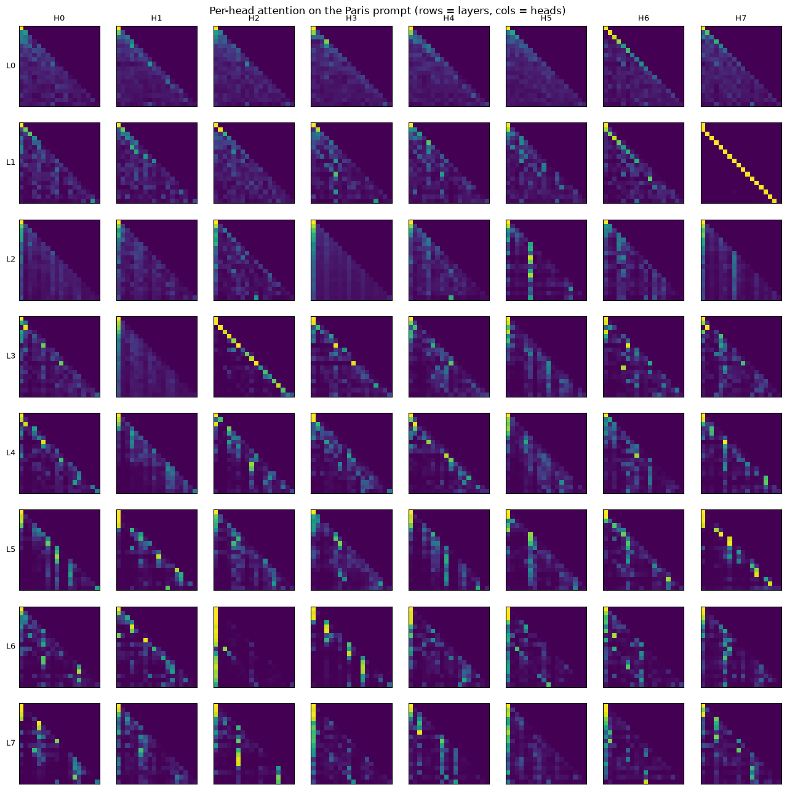
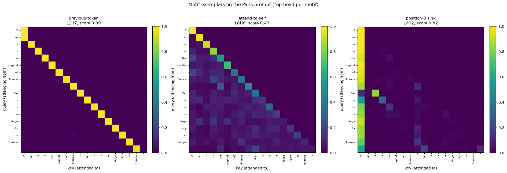
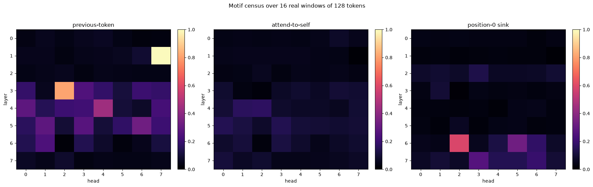
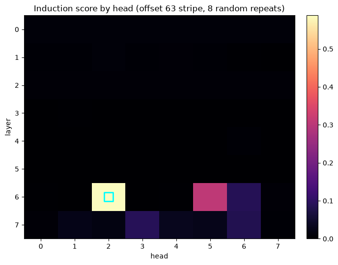
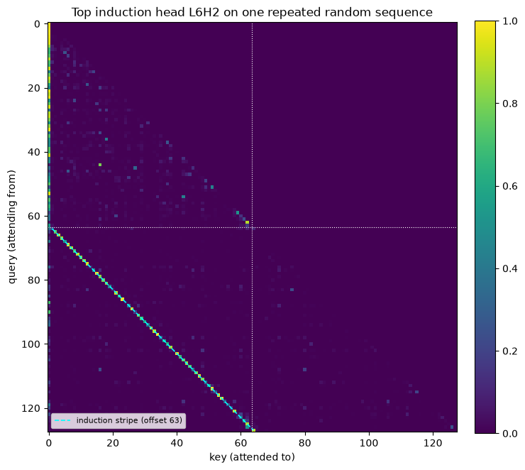
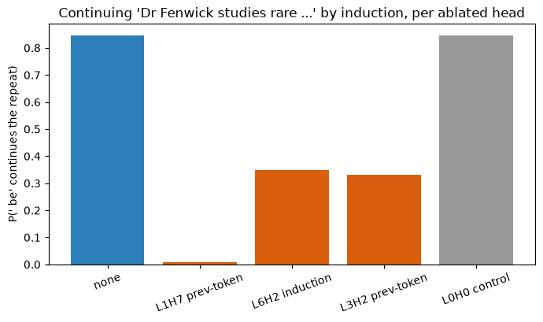
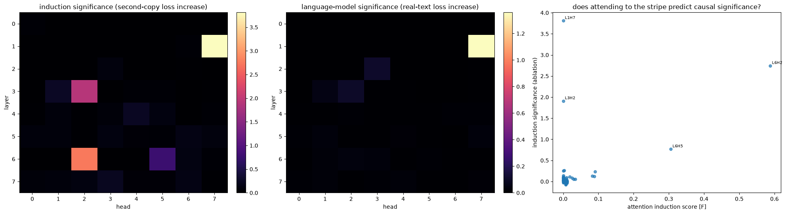
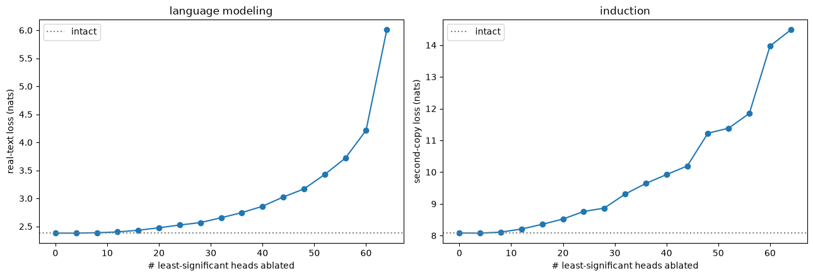

# Looking inside the transformer: attention patterns and induction heads

**Objective.** The repo's first interpretability notebook: read what the trained model's attention
heads do. Name the local motifs by eye, score them across all 64 heads, then detect an induction
head (look-back-and-copy) and prove it is load-bearing by ablation.

**[A] Setup.** Load the trained model and tokenizer from the shared cache, eval mode, so every
later cell probes one fixed set of weights. `load_model` rebuilds the `Transformer` from the
checkpoint's config and loads the weights; the checkpoint is addressed by a hash of its training
config, so this is the exact artifact the forward-pass notebook produced.

```python
import torch

from tinyterp import (
    cache_path,
    decode,
    encode,
    get_device,
    load_model,
    load_tokenizer,
)

device = get_device()

vocab, merges = load_tokenizer(cache_path("tokenizer_simplewiki_v2048.pkl"))
model, config, history = load_model(cache_path("transformer_simplewiki_e40ffbb37f24.pt"))
model.to(device).eval()

n_params = sum(p.numel() for p in model.parameters())
best_val = min(v for _, _, v in history)
print(f"{device=}")
print(f"{len(vocab)=}")
print(f"{n_params/1e6=:.1f}")
print(f"{config.n_layers=}, {config.n_heads=}, {config.d_model=}, {config.block_size=}")
print(f"{best_val=:.3f}")
```

```
device=device(type='cuda')
len(vocab)=2048
n_params/1e6=27.5
config.n_layers=8, config.n_heads=8, config.d_model=512, config.block_size=256
best_val=2.077
```

**[B] Attention capture.** Recover every head's attention weights.

```python
for block in model.blocks:
    block.attn.store_attn = True


def to_ids(text: str) -> torch.Tensor:
    """Encode text to a [1, seq] id tensor on the model device."""
    return torch.tensor([encode(text, vocab)], device=device)


@torch.no_grad()
def run_with_attention(input_ids: torch.Tensor) -> tuple[torch.Tensor, torch.Tensor]:
    """Forward pass returning (logits [1, seq, vocab], attn [n_layers, n_heads, seq, seq])."""
    logits = model(input_ids)
    attn = torch.stack([block.attn.last_attn[0] for block in model.blocks])
    return logits, attn


# Smoke test on a short real prompt: check shapes and that each query row is a causal distribution.
probe_text = "The capital city of France is Paris."
probe_ids = to_ids(probe_text)
_, probe_attn = run_with_attention(probe_ids)
seq = probe_ids.shape[1]
row_sums = probe_attn.sum(dim=-1)  # [n_layers, n_heads, seq]; every query row should sum to 1
upper = torch.triu(probe_attn, diagonal=1)  # mass strictly above the diagonal must be ~0 (causal)
print(f"{probe_attn.shape=}")
print(f"{seq=}")
print(f"{row_sums.min()=:.4f}, {row_sums.max()=:.4f}")
print(f"{upper.abs().max()=:.2e}")
```

```
probe_attn.shape=torch.Size([8, 8, 9, 9])
seq=9
row_sums.min()=1.0000, row_sums.max()=1.0000
upper.abs().max()=0.00e+00
```

**[C] The 8x8 census.** All 64 heads on one prompt, eyeballed before scoring: the weakest evidence
tier, and it can mislead (the L1H7 diagonal looks like attend-to-self but is not, see [D]). Panels
are autoscaled per head, so shapes compare but magnitudes do not.

```python
import matplotlib.pyplot as plt

grid_ids = to_ids("Paris is the capital of France. Paris is a large city in Europe.")
_, grid_attn = run_with_attention(grid_ids)
grid_attn = grid_attn.cpu()
n_layers, n_heads = grid_attn.shape[:2]

fig, axes = plt.subplots(n_layers, n_heads, figsize=(16, 16))
for l in range(n_layers):
    for h in range(n_heads):
        ax = axes[l, h]
        ax.imshow(grid_attn[l, h], cmap="viridis", aspect="equal")
        ax.set_xticks([])
        ax.set_yticks([])
        if l == 0:
            ax.set_title(f"H{h}", fontsize=9)
        if h == 0:
            ax.set_ylabel(f"L{l}", fontsize=9, rotation=0, ha="right", va="center")
fig.suptitle("Per-head attention on the Paris prompt (rows = layers, cols = heads)", y=0.90)
plt.show()
```



**[D] Three motif heads up close.** Score every head on the cells that define each motif
(previous-token = first sub-diagonal, self = main diagonal, sink = column 0) and show the arg-max
head, so the picture cannot flatter a hand-picked one. Previous-token L1H7 is near-pure (~0.99);
attend-to-self is weak (best L0H6 ~0.43) and, as [E] shows, no head specializes in it, so this
diagonal is a short-context effect.

```python
def token_labels(ids_row: torch.Tensor) -> list[str]:
    """Human-readable per-token strings, spaces shown as a middle dot."""
    return [decode([int(i)], vocab).replace(" ", "·") for i in ids_row]


labels = token_labels(grid_ids[0])
T_grid = grid_attn.shape[-1]
qi = torch.arange(T_grid)
motif_scores = {
    "previous-token": grid_attn[:, :, qi[1:], qi[1:] - 1].mean(-1),
    "attend-to-self": grid_attn[:, :, qi, qi].mean(-1),
    "position-0 sink": grid_attn[:, :, 1:, 0].mean(-1),
}

fig, axes = plt.subplots(1, 3, figsize=(19, 6.2))
for ax, (name, score) in zip(axes, motif_scores.items()):
    l, h = divmod(int(score.argmax()), n_heads)
    im = ax.imshow(grid_attn[l, h], cmap="viridis", vmin=0)
    ax.set_title(f"{name}\nL{l}H{h}, score {score.max():.2f}", fontsize=11)
    ax.set_xticks(range(T_grid))
    ax.set_yticks(range(T_grid))
    ax.set_xticklabels(labels, rotation=90, fontsize=7)
    ax.set_yticklabels(labels, fontsize=7)
    ax.set_xlabel("key (attended to)")
    ax.set_ylabel("query (attending from)")
    fig.colorbar(im, ax=ax, fraction=0.046, pad=0.04)
fig.suptitle("Motif exemplars on the Paris prompt (top head per motif)", y=1.02)
fig.tight_layout()
plt.show()
```



**[E] Motif census across all 64 heads.** Average each motif score over 16 real 128-token windows
from the cached corpus stream. Random mid-sentence offsets are fine: the motifs are
position-relative, not content-dependent. The "probe attention patterns" deliverable, a map of
which heads do which local operation.

```python
tokens = torch.load(cache_path("tokens_simplewiki_v2048_full.pt"), map_location="cpu")

BATCH, WIN = 16, 128
gen = torch.Generator().manual_seed(0)
starts = torch.randint(0, len(tokens) - WIN, (BATCH,), generator=gen)
real_batch = torch.stack([tokens[s : s + WIN].long() for s in starts]).to(device)
with torch.no_grad():
    model(real_batch)

qw = torch.arange(WIN)
prev_rows, self_rows, sink_rows = [], [], []
for block in model.blocks:
    a = block.attn.last_attn  # [BATCH, n_heads, WIN, WIN]
    self_rows.append(a[:, :, qw, qw].mean(dim=(0, 2)))
    prev_rows.append(a[:, :, qw[1:], qw[1:] - 1].mean(dim=(0, 2)))
    sink_rows.append(a[:, :, 1:, 0].mean(dim=(0, 2)))
census = {
    "previous-token": torch.stack(prev_rows).cpu(),
    "attend-to-self": torch.stack(self_rows).cpu(),
    "position-0 sink": torch.stack(sink_rows).cpu(),
}

fig, axes = plt.subplots(1, 3, figsize=(18, 5.5))
for ax, (name, mat) in zip(axes, census.items()):
    im = ax.imshow(mat, cmap="magma", vmin=0, vmax=1, aspect="auto")
    ax.set_title(name)
    ax.set_xlabel("head")
    ax.set_ylabel("layer")
    ax.set_xticks(range(n_heads))
    ax.set_yticks(range(n_layers))
    fig.colorbar(im, ax=ax, fraction=0.046, pad=0.04)
fig.suptitle(f"Motif census over {BATCH} real windows of {WIN} tokens", y=1.02)
fig.tight_layout()
plt.show()

for name, mat in census.items():
    top = torch.topk(mat.flatten(), 3)
    picks = [(int(i) // n_heads, int(i) % n_heads, float(v)) for i, v in zip(top.indices, top.values)]
    print(f"{name:16s} top3 (L,H,score): {[(l, h, round(s, 3)) for l, h, s in picks]}")
```



```
previous-token   top3 (L,H,score): [(1, 7, 0.993), (3, 2, 0.811), (4, 4, 0.442)]
attend-to-self   top3 (L,H,score): [(4, 2, 0.169), (4, 1, 0.164), (5, 0, 0.146)]
position-0 sink  top3 (L,H,score): [(6, 2, 0.587), (6, 5, 0.332), (7, 3, 0.263)]
```

**[F] Induction score across all 64 heads.** An induction head looks back to where it last saw a
token and copies the successor (+1), the atom of in-context learning (Olsson et al.). Why random
tokens: a random sequence has never existed, so the weights hold no successor information; any
success on the second copy must be in-context copying, not a memorized bigram (a wug test). Score =
mean attention on the offset-(REP-1) stripe (a second-copy query at REP+i reads key i+1); a
previous-token head scores ~0, so the metric is specific to look-back-and-copy.

```python
REP, N_SEQ = 64, 8
rng = torch.Generator().manual_seed(0)
single = torch.randint(0, config.vocab_size, (N_SEQ, REP), generator=rng)
repeated = torch.cat([single, single], dim=1).to(device)  # [N_SEQ, 2*REP]
with torch.no_grad():
    model(repeated)

# The induction stripe: query REP+i reads key i+1, i.e. queries [REP, 2*REP-1] read keys [1, REP].
q_idx = torch.arange(REP, 2 * REP)
k_idx = torch.arange(1, REP + 1)
induction = torch.stack(
    [block.attn.last_attn[:, :, q_idx, k_idx].mean(dim=(0, 2)) for block in model.blocks]
).cpu()  # [n_layers, n_heads]

top_flat = torch.topk(induction.flatten(), 5)
ind_l, ind_h = divmod(int(induction.argmax()), n_heads)
print(f"induction top5 (L,H,score): "
      f"{[(int(i) // n_heads, int(i) % n_heads, round(float(v), 3)) for i, v in zip(top_flat.indices, top_flat.values)]}")
print(f"top induction head: L{ind_l}H{ind_h}, score {induction.max():.3f}")

fig, ax = plt.subplots(figsize=(7, 5.5))
im = ax.imshow(induction, cmap="magma", vmin=0, aspect="auto")
ax.set_title(f"Induction score by head (offset {REP - 1} stripe, {N_SEQ} random repeats)")
ax.set_xlabel("head")
ax.set_ylabel("layer")
ax.set_xticks(range(n_heads))
ax.set_yticks(range(n_layers))
ax.scatter([ind_h], [ind_l], marker="s", s=180, facecolors="none", edgecolors="cyan", linewidths=2)
fig.colorbar(im, ax=ax, fraction=0.046, pad=0.04)
fig.tight_layout()
plt.show()
```

```
induction top5 (L,H,score): [(6, 2, 0.588), (6, 5, 0.306), (7, 3, 0.091), (6, 6, 0.088), (7, 6, 0.083)]
top induction head: L6H2, score 0.588
```



**[G] The winning head's stripe.** Falsification check: a score can be gamed by diffuse mass, a
picture cannot. The dashed line is the stripe (key = query - (REP-1)), the solid line the copy
boundary at REP; an induction head lights it up in the lower-left quadrant (second-copy queries
reading first-copy keys).

```python
demo = repeated[:1]
with torch.no_grad():
    model(demo)
demo_attn = model.blocks[ind_l].attn.last_attn[0, ind_h].cpu()  # [2*REP, 2*REP]

q_second = torch.arange(REP, 2 * REP)
k_stripe = q_second - (REP - 1)
stripe_mass = demo_attn[q_second, k_stripe].mean().item()
print(f"L{ind_l}H{ind_h}: mean second-copy mass on the induction stripe = {stripe_mass:.3f}")

fig, ax = plt.subplots(figsize=(7.5, 7))
im = ax.imshow(demo_attn, cmap="viridis", vmin=0)
ax.plot(k_stripe, q_second, ls="--", color="cyan", lw=1.2, label=f"induction stripe (offset {REP - 1})")
ax.axhline(REP - 0.5, color="white", lw=0.8, ls=":")
ax.axvline(REP - 0.5, color="white", lw=0.8, ls=":")
ax.set_title(f"Top induction head L{ind_l}H{ind_h} on one repeated random sequence")
ax.set_xlabel("key (attended to)")
ax.set_ylabel("query (attending from)")
ax.legend(loc="lower left", fontsize=8)
fig.colorbar(im, ax=ax, fraction=0.046, pad=0.04)
fig.tight_layout()
plt.show()
```

```
L6H2: mean second-copy mass on the induction stripe = 0.656
```



**[H] Ablate a head, concretely.** What does removing one attention head do? Zero-ablate it with a
reversible forward-pre-hook (zeroing its contiguous slice of `out_proj`'s input). On "Dr Fenwick
studies rare beetles. Dr Fenwick studies rare" the model continues " be" (start of "beetles") by
induction at P 0.85; ablating the previous-token head L1H7 drops it to 0.01, the induction head L6H2
to 0.35, controls not at all. Generating further, the baseline copies the established span while
L1H7 collapses fluency into loops and L6H2 keeps fluency but stops copying (two distinct failure
modes). [I] turns this into a significance number for every head.

```python
import math

from torch.nn import functional as F

vocab_size = config.vocab_size
head_dim = config.head_dim


def head_hook(h: int):
    """Forward-pre-hook that zeros head h's contiguous slice of out_proj's input."""
    def hook(module, inputs):
        (x,) = inputs
        x = x.clone()
        x[..., h * head_dim : (h + 1) * head_dim] = 0.0
        return (x,)
    return hook


@torch.no_grad()
def next_probs(text: str, ablate: tuple[int, int] | None = None) -> torch.Tensor:
    """Next-token distribution after `text`, optionally with head (layer, head) zero-ablated."""
    ids = torch.tensor([encode(text, vocab)], device=device)
    handle = None
    if ablate is not None:
        l, h = ablate
        handle = model.blocks[l].attn.out_proj.register_forward_pre_hook(head_hook(h))
    probs = F.softmax(model(ids)[0, -1], dim=-1)
    if handle:
        handle.remove()
    return probs


# Concrete: an arbitrary association stated once, then repeated. The token after the final "rare" is
# " be" (the start of "beetles"); predicting it requires looking back at the first occurrence, so it
# is induction, not word knowledge.
prompt = "Dr Fenwick studies rare beetles. Dr Fenwick studies rare"
target = encode(" beetles", vocab)[0]
demo_heads = [("none", None), ("L1H7 prev-token", (1, 7)), ("L6H2 induction", (6, 2)),
              ("L3H2 prev-token", (3, 2)), ("L0H0 control", (0, 0))]
demo = {label: next_probs(prompt, ab) for label, ab in demo_heads}
print(f"prompt: {prompt!r}")
for label, p in demo.items():
    print(f"  ablate {label:16s} P(' be')={float(p[target]):.3f}  argmax={decode([int(p.argmax())], vocab)!r}")

fig, ax = plt.subplots(figsize=(7, 4.2))
ax.bar([label for label, _ in demo_heads], [float(demo[label][target]) for label, _ in demo_heads],
       color=["#2c7fb8", "#d95f0e", "#d95f0e", "#d95f0e", "#999999"])
ax.set_ylabel("P(' be' continues the repeat)")
ax.set_title("Continuing 'Dr Fenwick studies rare ...' by induction, per ablated head")
ax.tick_params(axis="x", rotation=20)
fig.tight_layout()
plt.show()


@torch.no_grad()
def generate(text: str, n: int = 24, ablate: tuple[int, int] | None = None) -> str:
    """Greedy continuation of `text` (n tokens), with head (layer, head) held ablated throughout."""
    ids = encode(text, vocab)
    start = len(ids)
    handle = None
    if ablate is not None:
        l, h = ablate
        handle = model.blocks[l].attn.out_proj.register_forward_pre_hook(head_hook(h))
    for _ in range(n):
        x = torch.tensor([ids[-config.block_size :]], device=device)
        ids.append(int(model(x)[0, -1].argmax()))
    if handle:
        handle.remove()
    return decode(ids[start:], vocab)


# Over more tokens: greedy rollout with a head held ablated. The baseline copies the established span
# by induction; ablating L1H7 collapses fluency into loops, ablating L6H2 keeps fluency but drops the
# copy, and a control head changes nothing.
gen_conditions = [("none", None), ("L1H7 prev-token", (1, 7)), ("L6H2 induction", (6, 2)),
                  ("L0H0 control", (0, 0))]
gen_prompts = [
    "Aputsiaq the walrus loves to juggle rocks. Aputsiaq the walrus loves to",
    "Step one: mix flour. Step two: add water. Step three: bake bread. Step one: mix",
]
for gp in gen_prompts:
    print(f"\nprompt: {gp!r}")
    for label, ab in gen_conditions:
        print(f"  [{label:16s}] {generate(gp, 24, ab)!r}")
```

```
prompt: 'Dr Fenwick studies rare beetles. Dr Fenwick studies rare'


  ablate none             P(' be')=0.845  argmax=' be'
  ablate L1H7 prev-token  P(' be')=0.007  argmax='ly'
  ablate L6H2 induction   P(' be')=0.349  argmax=' be'
  ablate L3H2 prev-token  P(' be')=0.331  argmax='ly'
  ablate L0H0 control     P(' be')=0.846  argmax=' be'
```



```
prompt: 'Aputsiaq the walrus loves to juggle rocks. Aputsiaq the walrus loves to'
  [none            ] ' juggle rocks.\n\nAputsiaq is a term for a woman who'


  [L1H7 prev-token ] 'get, and togethers, and togethers, and together to the mouth.'


  [L6H2 induction  ] ' be freed by the walrus.\n\nAs a result of the fall of the M'
  [L0H0 control    ] ' juggle rocks.\n\nAputsiaq is a term for a woman who'

prompt: 'Step one: mix flour. Step two: add water. Step three: bake bread. Step one: mix'
  [none            ] 'ed with water. Step one: mixed with water. Step one: mixed with water.'


  [L1H7 prev-token ] '.\n\n\n\n\n\n\n\n\n\n\n\n\n\n\n\n\n\n\n\n\n\n\n'


  [L6H2 induction  ] 'ed with water.\n\nStepboarding\n\nStepboarding\n\nSte'
  [L0H0 control    ] 'ed with water. Step one: mixed with water. Step one: mixed with water.'
```

**[I] Head significance over many samples, sorted.** A head's significance is how much removing it
hurts, averaged over many samples for a stable ranking: induction (second-copy loss on 32
random-token repeats, as in [F], where only in-context copying can help) and language modeling
(next-token loss on 32 real Simple Wiki windows). Sorting all 64 heads reveals induction is a
two-head circuit: the most significant head for induction is the previous-token head L1H7 (+3.8
nats), above the induction head L6H2 (+2.7) itself, because L1H7 writes each token's predecessor
into the residual stream, forming the keys L6H2 matches against. The scatter is the lesson: L1H7 and
L3H2 have ~0 attention induction score ([F]) yet top the causal ranking, so an attention score finds
the visible head but misses the upstream head feeding it. For language modeling L1H7 is dominant
(+1.4 nats) and most heads are near zero. The sorted order feeds [J].

```python
# Significance = causal ablation damage, averaged over many random samples for a stable ranking.
@torch.no_grad()
def repeat_loss(seqs: torch.Tensor, start: int) -> float:
    """Mean next-token CE over queries [start, start+REP-1] of repeated sequences."""
    logits = model(seqs)
    return F.cross_entropy(logits[:, start : start + REP - 1, :].reshape(-1, vocab_size),
                           seqs[:, start + 1 : start + REP].reshape(-1)).item()


@torch.no_grad()
def lm_loss(seqs: torch.Tensor) -> float:
    """Mean next-token CE over real-text windows."""
    logits = model(seqs)
    return F.cross_entropy(logits[:, :-1, :].reshape(-1, vocab_size),
                           seqs[:, 1:].reshape(-1)).item()


SIG_SEQ, SIG_WIN = 32, 32
g_rep = torch.Generator().manual_seed(1)
sig_single = torch.randint(0, vocab_size, (SIG_SEQ, REP), generator=g_rep)
sig_repeats = torch.cat([sig_single, sig_single], dim=1).to(device)  # induction probe, many samples
g_win = torch.Generator().manual_seed(1)
sig_starts = torch.randint(0, len(tokens) - WIN, (SIG_WIN,), generator=g_win)
sig_windows = torch.stack([tokens[s : s + WIN].long() for s in sig_starts]).to(device)  # real text

uniform = math.log(vocab_size)
first_copy = repeat_loss(sig_repeats, start=0)     # control: first copy, nothing to look back to
base_ind = repeat_loss(sig_repeats, start=REP)     # second copy, induction working
base_lm = lm_loss(sig_windows)

# Significance of each head: the loss increase when it alone is ablated, for induction and for LM.
sig_ind = torch.zeros(n_layers, n_heads)
sig_lm = torch.zeros(n_layers, n_heads)
for l in range(n_layers):
    for h in range(n_heads):
        handle = model.blocks[l].attn.out_proj.register_forward_pre_hook(head_hook(h))
        sig_ind[l, h] = repeat_loss(sig_repeats, start=REP) - base_ind
        sig_lm[l, h] = lm_loss(sig_windows) - base_lm
        handle.remove()

# Sort heads least- to most-significant by language-modeling damage; this order feeds [J].
head_order = sorted(((l, h) for l in range(n_layers) for h in range(n_heads)), key=lambda p: float(sig_lm[p]))


def rank(pairs, mat):
    return [(l, h, round(float(mat[l, h]), 4)) for l, h in pairs]


print(f"{uniform=:.3f}, {first_copy=:.3f}, {base_ind=:.3f}, {base_lm=:.3f}")
print(f"most significant, LM:        {rank(head_order[-5:][::-1], sig_lm)}")
print(f"most significant, induction: {rank(sorted(head_order, key=lambda p: -float(sig_ind[p]))[:5], sig_ind)}")
print(f"least significant, LM:       {rank(head_order[:5], sig_lm)}")

# Two significance maps, and whether the [F] attention score predicts causal (induction) significance.
fig, axes = plt.subplots(1, 3, figsize=(20, 5.5))
for ax, mat, title in [
    (axes[0], sig_ind, "induction significance (second-copy loss increase)"),
    (axes[1], sig_lm, "language-model significance (real-text loss increase)"),
]:
    im = ax.imshow(mat, cmap="magma", vmin=0, aspect="auto")
    ax.set_title(title)
    ax.set_xlabel("head")
    ax.set_ylabel("layer")
    ax.set_xticks(range(n_heads))
    ax.set_yticks(range(n_layers))
    fig.colorbar(im, ax=ax, fraction=0.046, pad=0.04)
ax = axes[2]
ax.scatter(induction.flatten(), sig_ind.flatten(), s=25, alpha=0.7)
for l in range(n_layers):
    for h in range(n_heads):
        if induction[l, h] > 0.1 or sig_ind[l, h] > 0.3:
            ax.annotate(f"L{l}H{h}", (float(induction[l, h]), float(sig_ind[l, h])),
                        fontsize=7, xytext=(3, 3), textcoords="offset points")
ax.set_xlabel("attention induction score [F]")
ax.set_ylabel("induction significance (ablation)")
ax.set_title("does attending to the stripe predict causal significance?")
fig.tight_layout()
plt.show()
```

```
uniform=7.625, first_copy=12.030, base_ind=8.081, base_lm=2.380
most significant, LM:        [(1, 7, 1.3585), (2, 3, 0.1095), (3, 2, 0.1059), (3, 1, 0.0522), (6, 2, 0.0352)]
most significant, induction: [(1, 7, 3.813), (6, 2, 2.7469), (3, 2, 1.9109), (6, 5, 0.7706), (3, 1, 0.2612)]
least significant, LM:       [(1, 1, -0.0011), (0, 4, -0.0003), (0, 3, 0.0001), (0, 7, 0.0003), (0, 1, 0.0006)]
```



**[J] Ablate the least-significant heads: how much is redundant?** Using the significance order from
[I], remove heads least-significant-first and watch performance. The single least-significant head
(L1H1, LM damage about -0.001) is a no-op. Cumulatively the loss stays near the intact line for a
long stretch (8 heads: no change; 24 heads: +0.14 nats; half the heads: +0.27); removing the most
significant heads instead would break it at once (L1H7 alone is +1.4, [I]). The induction panel
(right) holds flat for the same reason and longer: the induction-critical heads (L1H7, L6H2, L3H2)
rank high, so this least-significant-first order removes them last. The printed
continuations make the drift legible: for 10 random Simple Wiki snippets, each row is the greedy
continuation with the k least-significant heads ablated, plain where it still matches the intact
(k=0) output and wrapped in ⟪...⟫ where it deviates. Many stay identical through the first 8 heads,
then
deviations appear and grow as more heads go (not strictly monotonically, greedy decoding can snap
back to the intact continuation at a later k).
Importance is concentrated in a handful of heads and most are individually redundant, the small-scale
version of Michel et al., "Are Sixteen Heads Really Better than One?".

```python
from collections import defaultdict

least = head_order[0]
print(f"least-significant head L{least[0]}H{least[1]} (LM damage {float(sig_lm[least]):+.4f})")


def ablate(pairs: list[tuple[int, int]]) -> list:
    """Zero-ablate a set of heads at once (grouped per layer); returns handles to remove."""
    by_layer = defaultdict(list)
    for l, h in pairs:
        by_layer[l].append(h)

    def layer_hook(hs):
        def hook(module, inputs):
            (x,) = inputs
            x = x.clone()
            for hh in hs:
                x[..., hh * head_dim : (hh + 1) * head_dim] = 0.0
            return (x,)
        return hook

    return [model.blocks[l].attn.out_proj.register_forward_pre_hook(layer_hook(hs)) for l, hs in by_layer.items()]


@torch.no_grad()
def generate_pruned(text: str, n: int, pairs: list[tuple[int, int]]) -> str:
    """Greedy continuation with a whole set of heads held ablated throughout."""
    ids = encode(text, vocab)
    start = len(ids)
    handles = ablate(pairs)
    for _ in range(n):
        x = torch.tensor([ids[-config.block_size :]], device=device)
        ids.append(int(model(x)[0, -1].argmax()))
    for h in handles:
        h.remove()
    return decode(ids[start:], vocab)


# Cumulative pruning curve, least-significant-first only.
ks = list(range(0, n_layers * n_heads + 1, 4))
prune_lm, prune_ind = [], []
for k in ks:
    handles = ablate(head_order[:k])
    prune_lm.append(lm_loss(sig_windows))
    prune_ind.append(repeat_loss(sig_repeats, start=REP))
    for x in handles:
        x.remove()

fig, (ax1, ax2) = plt.subplots(1, 2, figsize=(13, 4.5))
ax1.plot(ks, prune_lm, "-o", color="C0")
ax1.axhline(base_lm, color="gray", ls=":", label="intact")
ax1.set_xlabel("# least-significant heads ablated"); ax1.set_ylabel("real-text loss (nats)")
ax1.set_title("language modeling"); ax1.legend()
ax2.plot(ks, prune_ind, "-o", color="C0")
ax2.axhline(base_ind, color="gray", ls=":", label="intact")
ax2.set_xlabel("# least-significant heads ablated"); ax2.set_ylabel("second-copy loss (nats)")
ax2.set_title("induction"); ax2.legend()
fig.tight_layout()
plt.show()

# Watch generation drift as more least-significant heads are removed. Each row is the greedy
# continuation with the k least-significant heads ablated; text matching the intact (k=0) output is
# plain and the deviation is wrapped in guillemets, ⟪...⟫. The marked region creeps left as more
# heads go.
demo_ks = [0, 8, 16, 24, 32]
g_txt = torch.Generator().manual_seed(7)
sample_starts = torch.randint(0, len(tokens) - 24, (10,), generator=g_txt)
text_prompts = [decode(tokens[s : s + 24].tolist(), vocab) for s in sample_starts]
print("Generation drift as least-significant heads are pruned (⟪...⟫ = deviates from intact k=0):")
for tp in text_prompts:
    print(f"\n{tp!r}")
    intact = generate_pruned(tp, 16, []).replace("\n", "↵")
    for k in demo_ks:
        out = generate_pruned(tp, 16, head_order[:k]).replace("\n", "↵")
        cpl = 0
        while cpl < len(out) and cpl < len(intact) and out[cpl] == intact[cpl]:
            cpl += 1
        tail = f"⟪{out[cpl:]}⟫" if out[cpl:] else ""
        print(f"  k={k:2d}  {out[:cpl]}{tail}")
```

```
least-significant head L1H1 (LM damage -0.0011)
```



```
Generation drift as least-significant heads are pruned (⟪...⟫ = deviates from intact k=0):

' insecure.\n Lauren Tanner (played by Cassie Scerbo'
  k= 0  is) - A fictional character who played the character who played
  k= 8  ⟪) - A fictional character who played the character in the movie⟫
  k=16  i⟪t) - A fictional character who played the character in the⟫


  k=24  is) - ⟪a psychedelic rock band from the town⟫
  k=32  ⟪ña)↵ Laurent Tanner (played by⟫

'=right | 2.4 km || \n|-id=040 bgcolor=#fefefe\n| 39040 ||'
  k= 0    || — || September 7, 1999 || Socorro || LINEAR || — || align
  k= 8    || — || September 7, 1999 || Socorro || LINEAR || — || align


  k=16    || — || September 7, 1999 || Socorro || LINEAR || — || align
  k=24    || — || September ⟪1, 2000 || Socorro || ↵|-id=⟫
  k=32   ⟪= ↵|↵|↵|↵|↵|↵|↵⟫

' the province of Barcelona in the autonomous community of Catalonia in Sp'
  k= 0  ain.↵↵The province of Barcelona is in the northwest


  k= 8  ain.↵↵The province ⟪is divided into the following table⟫
  k=16  ain.↵↵The province ⟪is divided into two regions: the⟫
  k=24  ain.↵↵The province ⟪is in the northern part of the province of⟫
  k=32  ain.↵↵The province ⟪is in the northern part of the province.⟫

' player (Anyang Halla, national team), lung cancer.\nJan Klijnj'
  k= 0  a, 86, Dutch politician, Mayor of Amsterd


  k= 8  a, 86, Dutch politician, ⟪member of the House of Represent⟫
  k=16  a, 86, Dutch politician, Mayor of Amsterd
  k=24  ⟪ić, 80, Croatian politician, President of C⟫
  k=32  a⟪n Klein, 86, Dutch footballer (Dutch Lit⟫

' is a suburb of Hamilton. It was originally called Dulverton on the coun'


  k= 0  cil. It was named after the town of Dulverton, in
  k= 8  cil⟪ of the Dulver family. It was named after the Dul⟫
  k=16  cil⟪ of Hamilton. The name was changed to Dul⟫
  k=24  cil⟪ of the United Kingdom. It was first called Dulverton on⟫
  k=32  cil⟪ of Hamilton.↵↵References↵↵Other websites↵⟫

", edited by David A. Klamer, Dover; \n 1999 Gardner's Wh"


  k= 0  ite House biography, The New York Times, New York T
  k= 8  ite House biography, ⟪by David A. Klamer, D⟫
  k=16  ite House biography, ⟪by David A. Klamer, D⟫
  k=24  ite House biography⟪ by David A. Klein, Dove⟫
  k=32  ite House b⟪oarding school boarding school boarding school board⟫

' caused him to fall sick with tuberculosis. Warren Tubbs died'


  k= 0   on October 7, 2020 in Washington, D.C. from proble
  k= 8   on October 7, 20⟪17 in Los Angeles, California from cancer, age⟫
  k=16   on October 7, 20⟪17 in Los Angeles, California from cancer, age⟫
  k=24   on October 7, 20⟪17 in a hospital in Los Angeles⟫
  k=32   ⟪in the early 1970s.↵↵References↵↵Other websites↵↵⟫

' so much more beautiful, the worthier of its Author, when one knows that a small'


  k= 0  er one is a matter of the Author's Dictionary.
  k= 8  er one is a m⟪ountain.↵↵The Authority of the⟫
  k=16  er ⟪is a mountain.↵↵The Amazon is a⟫
  k=24  er ⟪is a mountain. The Author's idea was that⟫
  k=32  ⟪ number of people living in the Amazon.↵↵References↵⟫

'arette. The socket that the lighter goes in can also be used to power mob'


  k= 0  ile phones.↵↵There are many different types of light
  k= 8  ile phones.↵↵The⟪ lighter goes in the midd⟫
  k=16  ile phones.↵↵The⟪ lighter goes in the midd⟫
  k=24  ile phones.↵↵There are many different types of light
  k=32  ile phones.⟪ The lighter goes in the middle of⟫

'wder monkey.\n\nOther websites\n HMS Victory: The Crew \n\n'


  k= 0   ↵Military of the United States↵Military of the United States↵
  k= 8   ↵Military of the United States↵Military of the United States↵
  k=16   ↵⟪Crewe's Web site↵↵Crewe↵⟫
  k=24   ↵⟪The Crews of the United States: The Crews of⟫
  k=32   ↵⟪↵Music genres↵↵Musical groups↵M⟫
```

**[K] Findings and next steps.**

Attention patterns:

- Previous-token head L1H7 is nearly pure: ~0.99 of every query's mass one position back over 16
  real windows (second, weaker: L3H2 ~0.81).
- Position-0 sink concentrated at L6H2 (~0.59), L6H5 behind. No BOS token here, so position 0 is
  just the first token of the window; heads park mass there as a default.
- No head specializes in attend-to-self over real text (all below ~0.2). The strong self-diagonal
  on a short prompt ([D]) is a short-context artifact. The null is the payoff of scoring over a
  batch, not one sentence.

Induction heads:

- Ranked by the offset-(REP-1) stripe over random repeats, L6H2 stands out: score 0.588, nearly
  double runner-up L6H5 (0.31); on one repeat ~0.66 of each second-copy query's mass lands on the
  correct look-back cell.
- L6H2 is also the top position-0 sink on real text: one head, two faces. First copy (no match)
  defaults to the sink; second copy lights up the induction diagonal. The sink is its no-match
  default, induction its matched behavior (the role BOS plays for induction heads elsewhere).

Head significance and the induction circuit ([H], [I]):

- Concretely, on "Dr Fenwick studies rare beetles. Dr Fenwick studies rare" the model continues by
  induction: P(" be") = 0.85. Ablating the previous-token head L1H7 collapses it to 0.01, the
  induction head L6H2 to 0.35, control heads not at all. Generating further, the baseline copies the
  established span; ablating L1H7 degenerates into loops, L6H2 stays fluent but stops copying.
- Second-copy loss (8.08) is ~4 nats below first-copy (12.03): induction works. Both sit above
  uniform (log vocab 7.63) because the non-inductable positions stay confidently wrong on random
  tokens; the ~4-nat drop is the signal, not the absolute level.
- Ranking all 64 heads by ablation damage (over 32 samples) shows induction is a two-head circuit,
  not one head: the most significant head is the previous-token head L1H7 (+3.8 nats), above the
  induction head L6H2 (+2.7). L1H7 writes each token's predecessor into the residual stream, forming
  the keys L6H2 matches against; removing the upstream head breaks the circuit.
- The attention score ([F]) is blind to this: L1H7 and L3H2 score ~0 on the stripe (they look one
  token back, not REP-1) yet top the causal ranking. An attention-pattern score finds the visible
  head, not the upstream heads feeding it; only ablation reveals the circuit.
- For general language modeling, L1H7 is the single most load-bearing head (+1.4 nats); most others
  are near zero.

Redundancy ([J]):

- Importance is concentrated: removing the single least-significant head (L1H1) is a no-op. Ablating
  least-significant-first, ~24 of 64 heads come out for +0.14 nats and half for +0.27, and greedy
  generation on random Simple Wiki snippets often stays identical through the first ~8 heads, then
  deviations appear and grow. Removing the most significant heads first breaks it at once. Most
  heads are individually redundant (a miniature "Are Sixteen Heads Really Better than One?").
- Caveat: this is zero-ablation, which pushes the residual off-distribution (mean-ablation would be
  cleaner); the differential across heads and inputs is the robust part.

Dependencies (loaded, never retrained): checkpoint `transformer_simplewiki_e40ffbb37f24.pt`, the
v2048 tokenizer, and the token stream `tokens_simplewiki_v2048_full.pt` (sampled in [E]).

TODO:

- Copying score: does L6H2's OV path write the attended token into the logits, not just attend?
- Confirm the L1H7 to L6H2 composition directly (path patching), with mean-ablation to rule out
  zero-ablation off-distribution artifacts.
- Next notebook: logit lens (embed/unembed untied), watching predictions sharpen with depth.
