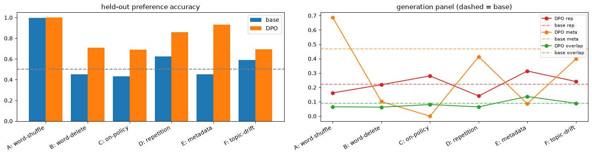
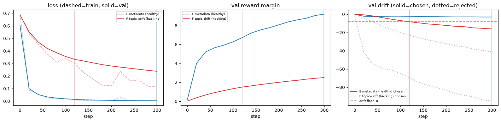

# RL'ing behaviors out of a base model with DPO: a uniform catalog

**Objective.** Post-training, the *preference optimization* curriculum item. Fine-tune the base
transformer directly against synthetic preference pairs with the DPO loss — no separate reward
network. The implicit reward of a sequence is `beta * (logp_policy - logp_ref)`; the loss is a
classifier pushing the trainable *policy* to score `chosen` above `rejected` relative to a frozen
*reference* copy of itself:

```
L = -logsigmoid( beta * ( (logp_pol(chosen) - logp_ref(chosen))
                        - (logp_pol(rej)    - logp_ref(rej)) ) )
```

where `logp` sums the log-probability of the *continuation* tokens under each model.

**This notebook is a catalog.** One shared setup + machinery block, then the same three-cell
template repeated per behavior we want to suppress: **(1) construction** of `(prompt, chosen, rejected)` pairs where `rejected` *is* the behavior; **(2) the RL loop** (DPO from a fresh policy,
with validation-tracked early stopping — see [T] — rather than a fixed step count); **(3) metrics &
samples** — held-out preference accuracy (base→DPO, with 95% CIs), the reward-margin decomposition, a
shared generation health panel, and base-vs-DPO greedy samples.

Six behaviors, all built from the corpus + the model itself — no human labels, no LLM generation:

| #   | behavior (the `rejected` side)  | construction                                 |
| --- | ------------------------------- | -------------------------------------------- |
| A   | scrambled word order            | shuffle the real continuation's words        |
| B   | dropped words                   | delete ~30% of the real continuation's words |
| C   | off-distribution self-samples   | the base model's *own* sampled continuation  |
| D   | repetition loops                | tile the continuation's first half           |
| E   | metadata / boilerplate collapse | a mined "References / Categories" tail       |
| F   | topic drift                     | a *different* article's continuation         |

The shared **generation panel** (`rep` = repeated-3-gram fraction = looping/degeneracy; `meta` =
fraction of samples emitting Wikipedia metadata tokens like "References / Categories"; `overlap` =
prompt↔continuation content-word Jaccard = on-topicality) lets us read each behavior's *own* target
metric move — and any cross-effects — on the same axes. (`rep` and `meta` are deliberately separate:
newline-loop degeneracy shows up in `rep`, not `meta`, so the two failure modes don't conflate.)

**[S1] Setup.** Two copies of the 27.5M base checkpoint: a frozen `ref` (grads off, the fixed anchor)
and — per run, inside `train_dpo` — a fresh trainable `policy`. One shared pool of `(prompt, chosen)`
examples: split each Simple Wikipedia article into sentences, take an adjacent pair (prompt = a
sentence, chosen = the next). Every behavior reuses this pool and differs only in how `rejected` is
built. Prompt and continuation are tokenized independently (continuation with a leading space) and
concatenated, so the continuation-token span is exact.

```python
import math
import random
import re
from collections import defaultdict

import matplotlib.pyplot as plt
import torch
import torch.nn.functional as F
from datasets import load_dataset

from tinyterp import cache_path, encode, get_device, load_model, load_tokenizer

device = get_device()
SEED = 0
random.seed(SEED)
torch.manual_seed(SEED)

vocab, merges = load_tokenizer(cache_path("tokenizer_simplewiki_v2048.pkl"))
BASE_CKPT = cache_path("transformer_simplewiki_e40ffbb37f24.pt")

ref, config, _ = load_model(BASE_CKPT)
ref.to(device).eval()
for p in ref.parameters():
    p.requires_grad_(False)

articles = load_dataset("wikimedia/wikipedia", "20231101.simple")["train"]

MIN_WORDS = 6  # continuations shorter than this make the distortions trivial


def decode_ids(ids: list[int]) -> str:
    return b"".join(vocab[t] for t in ids).decode("utf-8", "replace")


def split_sentences(text: str) -> list[str]:
    parts = re.split(r"(?<=[.!?])\s+", text.replace("\n", " "))
    return [p.strip() for p in parts if p.strip()]


def build_pool(n_examples: int, seed: int = 0) -> list[dict]:
    """One (prompt, chosen) example per article, tokenized once, until we have n_examples."""
    rng = random.Random(seed)
    order = list(range(len(articles)))
    rng.shuffle(order)
    pool: list[dict] = []
    for ai in order:
        sents = split_sentences(articles[ai]["text"])
        valid = [i for i in range(len(sents) - 1) if len(sents[i + 1].split()) >= MIN_WORDS]
        if not valid:
            continue
        i = rng.choice(valid)
        prompt_ids = encode(sents[i], vocab)
        chosen_ids = encode(" " + sents[i + 1], vocab)
        if not prompt_ids or len(prompt_ids) + len(chosen_ids) > config.block_size:
            continue
        pool.append(
            {
                "prompt_text": sents[i],
                "prompt_ids": prompt_ids,
                "chosen_text": sents[i + 1],
                "chosen_ids": chosen_ids,
            }
        )
        if len(pool) >= n_examples:
            break
    return pool


N_POOL = 8000
N_TRAIN = 6000
pool = build_pool(N_POOL, seed=SEED)
train_slice, held_slice = pool[:N_TRAIN], pool[N_TRAIN:]
panel_prompts = held_slice[:128]  # fixed prompt set for the generation panel (behavior-independent)
n_params = sum(p.numel() for p in ref.parameters())
print(f"{device=}  {n_params/1e6=:.1f}  block={config.block_size}")
print(f"{len(pool)=}  {len(train_slice)=}  {len(held_slice)=}  {len(panel_prompts)=}")
```

```
/home/trironkk/agent-worktrees/github.com/trironkk/tinyterp/a02/.venv/lib/python3.12/site-packages/tqdm/auto.py:21: TqdmWarning: IProgress not found. Please update jupyter and ipywidgets. See https://ipywidgets.readthedocs.io/en/stable/user_install.html
  from .autonotebook import tqdm as notebook_tqdm


Warning: You are sending unauthenticated requests to the HF Hub. Please set a HF_TOKEN to enable higher rate limits and faster downloads.


device=device(type='cuda')  n_params/1e6=27.5  block=256
len(pool)=8000  len(train_slice)=6000  len(held_slice)=2000  len(panel_prompts)=128
```

**[S2] Shared machinery.** Everything the per-behavior cells call. `masked_logp` is the core
primitive (summed log-prob over continuation tokens only; the mask zeroes prompt + right-padding,
safe under causal attention). `dpo_batch` is the loss plus diagnostics (reward margin, and the
policy's log-prob *drift* from the reference on each side — the honest read on whether the margin
moves by lifting chosen or crushing rejected). `train_dpo` starts a fresh policy from the base
checkpoint every call (so behaviors are independent and comparable) and trains it with
**validation-tracked early stopping**: it carves the last `N_VAL` pairs off the gradient as a
validation split, probes them every `EVAL_EVERY` steps with `eval_dpo`, and halts at the earlier of a
`chosen_drift` floor breach or a `val_loss` plateau (`stop_signal`), restoring the best *safe*
checkpoint (lowest val-loss among probes still within the drift floor). Section [T] is the diagnostic
that motivates this rule; here it is what every catalog run below uses instead of a fixed step count.
The **generation panel** (`generation_report`, defined here) batches greedy decoding (length-bucketed
— this model has no attention-mask input, so padding would corrupt positions) and scores the three
health metrics (see the title cell) on the same 128 prompts.

```python
BETA = 0.1
LR = 1e-5
STEPS = 300  # step budget; validation-tracked early stopping usually halts sooner
BATCH = 32
N_VAL = 384  # carved off each behavior's train split to drive the stopping rule (never seen by grads)
EVAL_EVERY = 20  # steps between validation probes
DRIFT_FLOOR = -8.0  # chosen_drift health floor: stop before real-text logp falls this far below ref
PATIENCE = 3  # val-loss early stop: consecutive non-improving probes tolerated
N_GEN = 40
TRIGGERS = ("References", "Other websites", "Related pages", "Living people", "births", "deaths")


def collate(batch: list[dict], key: str) -> tuple[torch.Tensor, torch.Tensor]:
    """Stack `prompt_ids || batch[key]` into right-padded [B, L]; mask is 1 on continuation tokens."""
    seqs = [ex["prompt_ids"] + ex[key] for ex in batch]
    length = max(len(s) for s in seqs)
    seq = torch.zeros(len(seqs), length, dtype=torch.long)
    mask = torch.zeros(len(seqs), length)
    for i, ex in enumerate(batch):
        s = ex["prompt_ids"] + ex[key]
        seq[i, : len(s)] = torch.tensor(s)
        mask[i, len(ex["prompt_ids"]) : len(s)] = 1.0
    return seq.to(device), mask.to(device)


def masked_logp(model, seq: torch.Tensor, cont_mask: torch.Tensor) -> torch.Tensor:
    """Summed log-prob of the masked (continuation) tokens under `model`. Returns [B]."""
    logp = F.log_softmax(model(seq), dim=-1)
    target = seq[:, 1:]
    tok_logp = logp[:, :-1, :].gather(-1, target.unsqueeze(-1)).squeeze(-1)
    return (tok_logp * cont_mask[:, 1:]).sum(-1)


def dpo_batch(policy, ref, batch: list[dict], beta: float = BETA) -> tuple[torch.Tensor, dict]:
    ch_seq, ch_mask = collate(batch, "chosen_ids")
    rej_seq, rej_mask = collate(batch, "rejected_ids")
    pol_ch, pol_rej = masked_logp(policy, ch_seq, ch_mask), masked_logp(policy, rej_seq, rej_mask)
    with torch.no_grad():
        ref_ch, ref_rej = masked_logp(ref, ch_seq, ch_mask), masked_logp(ref, rej_seq, rej_mask)
    gap = beta * ((pol_ch - pol_rej) - (ref_ch - ref_rej))
    loss = -F.logsigmoid(gap).mean()
    stats = {
        "loss": loss.item(),
        "margin": gap.mean().item(),
        "acc": (gap > 0).float().mean().item(),
        "chosen_drift": (pol_ch - ref_ch).mean().item(),
        "rejected_drift": (pol_rej - ref_rej).mean().item(),
    }
    return loss, stats


def stop_signal(history):
    """Earliest step the two-signal stopping rule fires on, given the validation probes so far, or
    None to keep training. (a) `chosen_drift` below `DRIFT_FLOOR` — the reward-hacking guard, a budget
    on how far the real text's log-prob may fall below the reference; (b) `val_loss` not improving for
    `PATIENCE` consecutive probes — ordinary overfitting of the preference to the train pairs."""
    latest = history[-1]
    if latest["val_chosen_drift"] < DRIFT_FLOOR:
        return latest["step"], "drift-guard"
    if len(history) > PATIENCE:
        prior_best = min(e["val_loss"] for e in history[:-PATIENCE])
        if all(e["val_loss"] >= prior_best - 1e-3 for e in history[-PATIENCE:]):
            return latest["step"], "val-loss plateau"
    return None


@torch.no_grad()
def eval_dpo(policy, ref, pairs, beta=BETA, bs=64) -> dict:
    """Validation read of a DPO run: mean DPO loss, preference accuracy, reward margin, and the
    chosen/rejected log-prob drift from `ref` — all on held-out pairs the optimizer never sees."""
    tot = len(pairs)
    loss = margin = chosen_drift = rejected_drift = correct = 0.0
    for i in range(0, tot, bs):
        b = pairs[i : i + bs]
        pc, pr = masked_logp(policy, *collate(b, "chosen_ids")), masked_logp(policy, *collate(b, "rejected_ids"))
        rc, rr = masked_logp(ref, *collate(b, "chosen_ids")), masked_logp(ref, *collate(b, "rejected_ids"))
        gap = beta * ((pc - pr) - (rc - rr))
        loss += -F.logsigmoid(gap).sum().item()
        margin += gap.sum().item()
        chosen_drift += (pc - rc).sum().item()
        rejected_drift += (pr - rr).sum().item()
        correct += (pc > pr).sum().item()
    return {"loss": loss / tot, "acc": correct / tot, "margin": margin / tot,
            "chosen_drift": chosen_drift / tot, "rejected_drift": rejected_drift / tot}


def train_dpo(train_pairs, steps=STEPS, lr=LR, beta=BETA, batch=BATCH, early_stop=True,
              n_val=N_VAL, every=EVAL_EVERY, seed=0):
    """Fresh policy from the base checkpoint, DPO-trained against the frozen `ref` with
    validation-tracked early stopping. The last `n_val` pairs are held out of the gradient as a
    validation split, probed every `every` steps (`eval_dpo`); training halts at the earlier of a
    `chosen_drift` floor breach or a `val_loss` plateau (`stop_signal`), and the best *safe*
    checkpoint — lowest val-loss among probes still within the drift floor — is restored. Pass
    `early_stop=False` to run the full `steps` budget instead (the [T] diagnostic). Returns
    (policy, info) where info carries the probe history and the stop step/reason/kept step."""
    torch.manual_seed(seed)
    rng = random.Random(seed)
    grad_pairs, val_pairs = train_pairs[:-n_val], train_pairs[-n_val:]
    policy, _, _ = load_model(BASE_CKPT)
    policy.to(device).train()
    opt = torch.optim.AdamW(policy.parameters(), lr=lr)
    history = []
    best = {"val_loss": float("inf"), "step": 0, "state": None}
    stop_step, reason = steps - 1, "budget"
    for step in range(steps):
        loss, _ = dpo_batch(policy, ref, rng.sample(grad_pairs, batch), beta)
        opt.zero_grad()
        loss.backward()
        opt.step()
        if step % every == 0 or step == steps - 1:
            policy.eval()
            val = eval_dpo(policy, ref, val_pairs, beta=beta)
            policy.train()
            history.append({"step": step, "train_loss": loss.item(),
                            **{f"val_{k}": v for k, v in val.items()}})
            if val["chosen_drift"] >= DRIFT_FLOOR and val["loss"] < best["val_loss"] - 1e-3:
                best = {"val_loss": val["loss"], "step": step,
                        "state": {k: v.detach().cpu().clone() for k, v in policy.state_dict().items()}}
            sig = stop_signal(history)
            if step % 100 == 0 or (early_stop and sig):
                print(f"  step {step:3d}  val_loss {val['loss']:.4f}  margin {val['margin']:+.3f}"
                      f"  drift ch {val['chosen_drift']:+.2f}")
            if early_stop and sig:
                stop_step, reason = sig
                break
    if early_stop and best["state"] is not None:
        policy.load_state_dict({k: v.to(device) for k, v in best["state"].items()})
    policy.eval()
    return policy, {"history": history, "stop_step": stop_step, "reason": reason, "kept_step": best["step"]}


@torch.no_grad()
def generate(model, prompt_text, max_new_tokens=N_GEN, temperature=0.8, greedy=False, seed=0):
    model.eval()
    torch.manual_seed(seed)
    block = config.block_size
    ids = torch.tensor([encode(prompt_text, vocab)], device=device)
    start = ids.shape[1]
    for _ in range(max_new_tokens):
        logits = model(ids[:, -block:])[:, -1, :]
        nxt = logits.argmax(-1, keepdim=True) if greedy else \
            torch.multinomial(F.softmax(logits / temperature, dim=-1), 1)
        ids = torch.cat([ids, nxt], dim=1)
    return decode_ids(ids[0, start:].tolist())


@torch.no_grad()
def batched_generate(model, prompt_ids_list, n_new=N_GEN, seed=0):
    """Greedy continuations for many prompts; length-bucketed so each batch runs unpadded."""
    torch.manual_seed(seed)
    model.eval()
    block = config.block_size
    cap = block - n_new
    conts: list = [None] * len(prompt_ids_list)
    buckets = defaultdict(list)
    for i, p in enumerate(prompt_ids_list):
        buckets[len(p[-cap:])].append(i)
    for _, idxs in buckets.items():
        ids = torch.tensor([prompt_ids_list[i][-cap:] for i in idxs], device=device)
        lp = ids.shape[1]
        for _ in range(n_new):
            logits = model(ids[:, -block:])[:, -1, :]
            ids = torch.cat([ids, logits.argmax(-1, keepdim=True)], dim=1)
        for j, i in enumerate(idxs):
            conts[i] = ids[j, lp:].tolist()
    return conts


def rep_fraction(ids, n=3) -> float:
    """Fraction of repeated n-grams: 1 - distinct-n. Higher = more looping."""
    if len(ids) <= n:
        return 0.0
    grams = [tuple(ids[k : k + n]) for k in range(len(ids) - n + 1)]
    return 1 - len(set(grams)) / len(grams)


def content_words(text: str) -> set:
    return set(re.findall(r"[a-z]{4,}", text.lower()))


def generation_report(model, prompts, seed=0) -> dict:
    """Health panel over a fixed prompt set, from greedy generations: `rep` = repeated-3-gram fraction
    (looping/degeneracy), `meta` = genuine metadata-token emission ("References / Categories"),
    `overlap` = prompt↔continuation content-word Jaccard (on-topicality). `meta` is trigger tokens
    only — newline-loop degeneracy lands in `rep`, so the two failure modes stay separated."""
    conts = batched_generate(model, [ex["prompt_ids"] for ex in prompts], seed=seed)
    rep = meta = overlap = 0.0
    for ex, c in zip(prompts, conts):
        rep += rep_fraction(c)
        txt = decode_ids(c)
        meta += 1.0 if any(t in txt for t in TRIGGERS) else 0.0
        pcw, ccw = content_words(ex["prompt_text"]), content_words(txt)
        overlap += len(pcw & ccw) / len(pcw | ccw) if (pcw | ccw) else 0.0
    n = len(prompts)
    return {"rep": rep / n, "meta": meta / n, "overlap": overlap / n}


@torch.no_grad()
def pref_accuracy(model, pairs, bs=64) -> float:
    """Fraction of pairs the model scores chosen > rejected (raw continuation log-prob)."""
    correct = 0
    for i in range(0, len(pairs), bs):
        b = pairs[i : i + bs]
        ch = masked_logp(model, *collate(b, "chosen_ids"))
        rej = masked_logp(model, *collate(b, "rejected_ids"))
        correct += (ch > rej).sum().item()
    return correct / len(pairs)


@torch.no_grad()
def margin_stats(policy, ref, pairs, beta=BETA, bs=64) -> dict:
    tot = len(pairs)
    agg = dict(margin=0.0, chosen_drift=0.0, rejected_drift=0.0)
    for i in range(0, tot, bs):
        b = pairs[i : i + bs]
        pc, pr = masked_logp(policy, *collate(b, "chosen_ids")), masked_logp(policy, *collate(b, "rejected_ids"))
        rc, rr = masked_logp(ref, *collate(b, "chosen_ids")), masked_logp(ref, *collate(b, "rejected_ids"))
        agg["margin"] += (beta * ((pc - pr) - (rc - rr))).sum().item()
        agg["chosen_drift"] += (pc - rc).sum().item()
        agg["rejected_drift"] += (pr - rr).sum().item()
    return {k: v / tot for k, v in agg.items()}


def ci95(p, n):
    return 1.96 * math.sqrt(p * (1 - p) / n)


RESULTS: dict[str, dict] = {}


def report_behavior(name, policy, held_pairs, info):
    """Uniform metrics + samples block: where early stopping halted, pref-acc base→DPO (+CI),
    margin/drift, generation panel base→DPO, and four base-vs-DPO greedy samples. Records into RESULTS
    for the closing summary."""
    n = len(held_pairs)
    base_acc, dpo_acc = pref_accuracy(ref, held_pairs), pref_accuracy(policy, held_pairs)
    ms = margin_stats(policy, ref, held_pairs)
    panel = generation_report(policy, panel_prompts)
    print(f"[{name}]  stopped @ {info['stop_step']}/{STEPS} ({info['reason']}), kept step {info['kept_step']}")
    print(f"   preference accuracy  base {base_acc:.3f} ± {ci95(base_acc, n):.3f}"
          f"  ->  DPO {dpo_acc:.3f} ± {ci95(dpo_acc, n):.3f}   (n={n})")
    print(f"   reward margin {ms['margin']:+.2f}   drift  chosen {ms['chosen_drift']:+.2f}"
          f"   rejected {ms['rejected_drift']:+.2f}")
    print(f"   gen panel   rep {BASE_PANEL['rep']:.3f}->{panel['rep']:.3f}"
          f"   meta {BASE_PANEL['meta']:.3f}->{panel['meta']:.3f}"
          f"   overlap {BASE_PANEL['overlap']:.3f}->{panel['overlap']:.3f}")
    RESULTS[name] = {"base_acc": base_acc, "dpo_acc": dpo_acc, **ms, "panel": panel,
                     "stop_step": info["stop_step"], "reason": info["reason"]}
    for ex in held_pairs[:4]:
        pt = ex["prompt_text"]
        print("   PROMPT:", pt[:96])
        print("     base:", repr(generate(ref, pt, greedy=True)))
        print("     DPO :", repr(generate(policy, pt, greedy=True)))


BASE_PANEL = generation_report(ref, panel_prompts)
print(f"base generation panel: rep {BASE_PANEL['rep']:.3f}  meta {BASE_PANEL['meta']:.3f}"
      f"  overlap {BASE_PANEL['overlap']:.3f}")
```

```
base generation panel: rep 0.222  meta 0.469  overlap 0.088
```

## Behavior A — scrambled word order

**[A1] Construction.** `rejected` = the real continuation with its words shuffled (retry so it
differs). The reward-model notebook found this is ~100% linearly separable on frozen features — the
base already ranks ordered text above scrambled, so expect little headroom (base pref-acc near 1).

```python
def shuffle_words(text, rng):
    words = text.split()
    out = words[:]
    for _ in range(10):
        rng.shuffle(out)
        if out != words:
            break
    return " ".join(out)


def attach_distortion(examples, fn, seed=0):
    rng = random.Random(seed)
    out = []
    for ex in examples:
        rej = fn(ex["chosen_text"], rng)
        out.append({**ex, "rejected_text": rej, "rejected_ids": encode(" " + rej, vocab)})
    return out


shuffle_pairs = attach_distortion(pool, shuffle_words, seed=SEED)
shuffle_tr, shuffle_he = shuffle_pairs[:N_TRAIN], shuffle_pairs[N_TRAIN:]
for ex in shuffle_he[:2]:
    print("CHOSEN:", repr(ex["chosen_text"]))
    print("REJECT:", repr(ex["rejected_text"]), "\n")
```

```
CHOSEN: "He was the second son of Cosimo III de' Medici, Grand Duke of Tuscany and Marguerite Louise d'Orléans."
REJECT: "de' son d'Orléans. He Duke Cosimo the of Louise III second Medici, and Grand of was Tuscany Marguerite" 

CHOSEN: 'The rocks where it was found were redescribed as "mid-Jurassic" after the discovery had been announced.'
REJECT: 'announced. after redescribed had discovery were been it rocks The the as where was "mid-Jurassic" found' 
```

```python
policy_shuffle, info_shuffle = train_dpo(shuffle_tr, seed=SEED)
```

```
  step   0  val_loss 0.6643  margin +0.060  drift ch +0.06


  step 100  val_loss 0.0776  margin +3.448  drift ch -3.28


  step 200  val_loss 0.0442  margin +4.698  drift ch -6.03


  step 280  val_loss 0.0332  margin +5.470  drift ch -8.29
```

```python
report_behavior("A: word-shuffle", policy_shuffle, shuffle_he, info_shuffle)
```

```
[A: word-shuffle]  stopped @ 280/300 (drift-guard), kept step 260
   preference accuracy  base 0.996 ± 0.003  ->  DPO 1.000 ± 0.001   (n=2000)
   reward margin +5.55   drift  chosen -7.45   rejected -62.94
   gen panel   rep 0.222->0.162   meta 0.469->0.688   overlap 0.088->0.065
   PROMPT: Gian Gastone de' Medici (24 May 1671 – 9 July 1737) was the last Medici Grand Duke of Tuscany.
     base: ' He was the son of the Duke of Tuscany and Maria Theresa of Austria. He was the first wife of the Duke of Tuscany'


     DPO : ' He was born in Tuscany, Tuscany.\n\nGastone died on 9 July 1737 in Tuscany, Tuscany, Italy from a st'
   PROMPT: It is one of the most complete dinosaurs found in Africa so far.
     base: ' It is a sauropod. It is a sauropod. It is a sauropod. It is a sauropod. It is a sauropod.'
     DPO : '\n\nReferences\n\nDinosaurs of Africa\nCarrotUltraviolet is a genus of dinosaur from the Upper'
   PROMPT: This is how ordinary people use the words.


     base: '\n\nThe word "display" is a shortened version of the word "display" which is used in the English language.\n\nThe word "d'
     DPO : '\n\nThe word "drama" comes from the Latin words  (originally, "drama") and  (originally, "drama"'
   PROMPT: It went to number 12 in Ireland, number 22 in the United Kingdom, number 30 in France and number
     base: '\n\nIn the United States, the number of people in the United Kingdom and number 3 in the United States is listed as number 3 in the United States.\n\nIn the United States,'


     DPO : '\n\nReferences\n\nOther websites\n\n1990 births\nLiving people\nBritish movie actors\nBritish television actors\nBritish stage actors\nBritish voice actors\nActors from Dub'
```

## Behavior B — dropped words

**[B1] Construction.** `rejected` = the real continuation with ~30% of words deleted (always at
least one). Corrupts completeness rather than order. Note this is the one construction that is *not*
length-matched — deletion shortens `rejected`, and summed log-prob is length-biased (fewer negative
terms), so the base actually *prefers* the truncated version (pref-acc below chance). Read the
base→DPO move here partly as DPO overcoming that length bias, not purely a completeness preference.

```python
def delete_words(text, rng, frac=0.3):
    words = text.split()
    keep = [w for w in words if rng.random() > frac]
    if len(keep) == len(words):
        del keep[rng.randrange(len(keep))]
    return " ".join(keep) if keep else words[0]


delete_pairs = attach_distortion(pool, delete_words, seed=SEED)
delete_tr, delete_he = delete_pairs[:N_TRAIN], delete_pairs[N_TRAIN:]
for ex in delete_he[:2]:
    print("CHOSEN:", repr(ex["chosen_text"]))
    print("REJECT:", repr(ex["rejected_text"]), "\n")
```

```
CHOSEN: "He was the second son of Cosimo III de' Medici, Grand Duke of Tuscany and Marguerite Louise d'Orléans."
REJECT: "the second son of III de' Medici, Grand Duke of and Louise d'Orléans." 

CHOSEN: 'The rocks where it was found were redescribed as "mid-Jurassic" after the discovery had been announced.'
REJECT: 'The rocks where it was found were redescribed "mid-Jurassic" discovery had been' 
```

```python
policy_delete, info_delete = train_dpo(delete_tr, seed=SEED)
```

```
  step   0  val_loss 0.6857  margin +0.016  drift ch +0.15


  step 100  val_loss 0.4044  margin +0.924  drift ch +1.48


  step 200  val_loss 0.3255  margin +1.431  drift ch -0.14
```

```python
report_behavior("B: word-delete", policy_delete, delete_he, info_delete)
```

```
[B: word-delete]  stopped @ 299/300 (budget), kept step 299
   preference accuracy  base 0.452 ± 0.022  ->  DPO 0.710 ± 0.020   (n=2000)
   reward margin +1.96   drift  chosen -1.12   rejected -20.73
   gen panel   rep 0.222->0.219   meta 0.469->0.102   overlap 0.088->0.062
   PROMPT: Gian Gastone de' Medici (24 May 1671 – 9 July 1737) was the last Medici Grand Duke of Tuscany.
     base: ' He was the son of the Duke of Tuscany and Maria Theresa of Austria. He was the first wife of the Duke of Tuscany'


     DPO : ' He was born in Tuscany, Tuscany. He was the son of Louis XVIII and Marquis of Franceschiux Gastone G'
   PROMPT: It is one of the most complete dinosaurs found in Africa so far.
     base: ' It is a sauropod. It is a sauropod. It is a sauropod. It is a sauropod. It is a sauropod.'
     DPO : ' It was discovered in 1986. It is one of the largest dinosaurs of the Rhapsody. It was discovered in 1986. It'
   PROMPT: This is how ordinary people use the words.


     base: '\n\nThe word "display" is a shortened version of the word "display" which is used in the English language.\n\nThe word "d'
     DPO : ' The words are invented in the 20th century. The words are invented in the 20th century. The words are invented in the 20th century. The'
   PROMPT: It went to number 12 in Ireland, number 22 in the United Kingdom, number 30 in France and number
     base: '\n\nIn the United States, the number of people in the United Kingdom and number 3 in the United States is listed as number 3 in the United States.\n\nIn the United States,'


     DPO : ' Their first album, Songs from the Samurai was released on October 12, 2013. Their second album, Songs from the Samurai was released on October'
```

## Behavior C — off-distribution self-samples (on-policy)

**[C1] Construction.** `rejected` = the base model's *own* sampled continuation from the same
prompt; `chosen` = the real one, truncated to the same token count (≤48) so the preference can't be
won on length. Unlike the distortions, the base does *not* already win here — it assigns its own
samples high probability — so this is where real headroom (and a real accuracy boost) lives.
Bucketed by prompt length so sampling runs unpadded.

```python
L_OP = 48


@torch.no_grad()
def sample_onpolicy(examples, max_len=L_OP, temperature=1.0, seed=0):
    torch.manual_seed(seed)
    block = config.block_size
    buckets = defaultdict(list)
    for idx, ex in enumerate(examples):
        buckets[len(ex["prompt_ids"])].append(idx)
    out: list = [None] * len(examples)
    for lp, idxs in buckets.items():
        ks = {i: min(len(examples[i]["chosen_ids"]), max_len) for i in idxs}
        n_tokens = min(max(ks.values()), block - lp)
        ids = torch.tensor([examples[i]["prompt_ids"] for i in idxs], device=device)
        for _ in range(n_tokens):
            logits = ref(ids[:, -block:])[:, -1, :]
            nxt = torch.multinomial(F.softmax(logits / temperature, dim=-1), 1)
            ids = torch.cat([ids, nxt], dim=1)
        gen = ids[:, lp:]
        for j, i in enumerate(idxs):
            k = ks[i]
            rej, chosen = gen[j, :k].tolist(), examples[i]["chosen_ids"][:k]
            out[i] = {**examples[i], "chosen_ids": chosen, "rejected_ids": rej,
                      "chosen_text": decode_ids(chosen), "rejected_text": decode_ids(rej)}
    return out


print("sampling on-policy rejects ...", flush=True)
onpolicy_pairs = sample_onpolicy(pool, seed=SEED)
onpolicy_tr, onpolicy_he = onpolicy_pairs[:N_TRAIN], onpolicy_pairs[N_TRAIN:]
for ex in onpolicy_he[:2]:
    print("CHOSEN:", repr(ex["chosen_text"]))
    print("REJECT:", repr(ex["rejected_text"]), "\n")
```

```
sampling on-policy rejects ...


CHOSEN: " He was the second son of Cosimo III de' Medici, Grand Duke of Tuscany and Marguerite Louise d'Orléans."
REJECT: ' He was from Italy.\n\n1682 births\n1737 deaths\nHouse of Valois\nPeople from FlorenceThe current mayor of cities in Mexico City, like mar' 

CHOSEN: ' The rocks where it was found were redescribed as "mid-Jurassic" after the discovery had been announced.'
REJECT: ' It has explorers in the Middle East. None of its carnivores are found in Bordegascendo, follow' 
```

```python
policy_onpolicy, info_onpolicy = train_dpo(onpolicy_tr, seed=SEED)
```

```
  step   0  val_loss 0.6841  margin +0.019  drift ch +0.19


  step 100  val_loss 0.5088  margin +0.653  drift ch +5.22


  step 200  val_loss 0.4144  margin +1.114  drift ch +5.60
```

```python
report_behavior("C: on-policy", policy_onpolicy, onpolicy_he, info_onpolicy)
```

```
[C: on-policy]  stopped @ 299/300 (budget), kept step 299
   preference accuracy  base 0.431 ± 0.022  ->  DPO 0.688 ± 0.020   (n=2000)
   reward margin +2.06   drift  chosen +4.15   rejected -16.44
   gen panel   rep 0.222->0.280   meta 0.469->0.000   overlap 0.088->0.081
   PROMPT: Gian Gastone de' Medici (24 May 1671 – 9 July 1737) was the last Medici Grand Duke of Tuscany.
     base: ' He was the son of the Duke of Tuscany and Maria Theresa of Austria. He was the first wife of the Duke of Tuscany'


     DPO : ' He was born in Tuscany, Italy. He was the son of Margaret of Denmark and Margaret of Denmark. He was the first'
   PROMPT: It is one of the most complete dinosaurs found in Africa so far.
     base: ' It is a sauropod. It is a sauropod. It is a sauropod. It is a sauropod. It is a sauropod.'
     DPO : ' It lived about 75 million years ago. It was about  long. It was about  long. It was about  long. It was about  long. It was about  long.'
   PROMPT: This is how ordinary people use the words.


     base: '\n\nThe word "display" is a shortened version of the word "display" which is used in the English language.\n\nThe word "d'
     DPO : ' It is a very popular sport in the United States. It is a popular sport in the United States. It is in the state of Texas. It is in the state of Texas. It'
   PROMPT: It went to number 12 in Ireland, number 22 in the United Kingdom, number 30 in France and number
     base: '\n\nIn the United States, the number of people in the United Kingdom and number 3 in the United States is listed as number 3 in the United States.\n\nIn the United States,'


     DPO : ' It is the third longest running number in the world. It is the third longest running number in the world. It is the second longest running number in the world. It'
```

## Behavior D — repetition loops

**[D1] Construction.** The base's #1 generation defect (see the base panel `rep`). `rejected` =
the continuation's first half tiled to full length ("He was a career soldier. He was a career
soldier."), length-matched to `chosen`. Since `rejected` shares its first half with `chosen`, the
shared prefix cancels in the margin — the signal is purely "continue vs re-emit."

```python
def make_repetition(examples):
    out = []
    for ex in examples:
        c = ex["chosen_ids"]
        h = max(4, len(c) // 2)
        rej = (c[:h] * (len(c) // h + 1))[: len(c)]
        out.append({**ex, "rejected_ids": rej, "rejected_text": decode_ids(rej)})
    return out


rep_pairs = make_repetition(pool)
rep_tr, rep_he = rep_pairs[:N_TRAIN], rep_pairs[N_TRAIN:]
for ex in rep_he[:2]:
    print("CHOSEN:", repr(ex["chosen_text"]))
    print("REJECT:", repr(ex["rejected_text"]), "\n")
```

```
CHOSEN: "He was the second son of Cosimo III de' Medici, Grand Duke of Tuscany and Marguerite Louise d'Orléans."
REJECT: " He was the second son of Cosimo III de' Medici, Grand Duk He was the second son of Cosimo III de' Medici, Grand Duk" 

CHOSEN: 'The rocks where it was found were redescribed as "mid-Jurassic" after the discovery had been announced.'
REJECT: ' The rocks where it was found were redescribed as "mid The rocks where it was found were redescribed as "mid' 
```

```python
policy_rep, info_rep = train_dpo(rep_tr, seed=SEED)
```

```
  step   0  val_loss 0.6757  margin +0.036  drift ch -0.03


  step  80  val_loss 0.1294  margin +2.441  drift ch -9.25
```

```python
report_behavior("D: repetition", policy_rep, rep_he, info_rep)
```

```
[D: repetition]  stopped @ 80/300 (drift-guard), kept step 60
   preference accuracy  base 0.625 ± 0.021  ->  DPO 0.858 ± 0.015   (n=2000)
   reward margin +2.11   drift  chosen -6.94   rejected -28.02
   gen panel   rep 0.222->0.140   meta 0.469->0.414   overlap 0.088->0.064
   PROMPT: Gian Gastone de' Medici (24 May 1671 – 9 July 1737) was the last Medici Grand Duke of Tuscany.
     base: ' He was the son of the Duke of Tuscany and Maria Theresa of Austria. He was the first wife of the Duke of Tuscany'


     DPO : ' He was the first wife of the Duke of Tuscany.\n\n1671 births\n1737 deaths\nHouse of Tuscany\nPeople from Turin'
   PROMPT: It is one of the most complete dinosaurs found in Africa so far.
     base: ' It is a sauropod. It is a sauropod. It is a sauropod. It is a sauropod. It is a sauropod.'
     DPO : ' It is among the most extinct volcanic eruptions.\n\nDinosaurs of Africa\nVolcanoes of North America'
   PROMPT: This is how ordinary people use the words.


     base: '\n\nThe word "display" is a shortened version of the word "display" which is used in the English language.\n\nThe word "d'
     DPO : '\n\nThe word "digestive" comes from the Latin word for "digestive" and "digested".\n\nThe word "digestive'
   PROMPT: It went to number 12 in Ireland, number 22 in the United Kingdom, number 30 in France and number
     base: '\n\nIn the United States, the number of people in the United Kingdom and number 3 in the United States is listed as number 3 in the United States.\n\nIn the United States,'


     DPO : '\n\nReferences\n\nOther websites\n\n1990 births\nLiving people\nBritish movie actors\nBritish television actors\nBritish stage actors\nBritish voice actors\nActors from London\n'
```

## Behavior E — metadata / boilerplate collapse

**[E1] Construction.** The base bails from prose into Wikipedia scaffolding ("References / Other
websites / 1987 births / Living people"). Mine those tails from the corpus (present in ~64% of
articles), and set `rejected` = a mined metadata tail tiled/truncated to `chosen`'s length; `chosen`
= the real prose continuation. Teaches "stay in prose, don't dump metadata mid-body."

```python
def mine_boilerplate(n_chunks, seed=0):
    rng = random.Random(seed)
    order = list(range(len(articles)))
    rng.shuffle(order)
    chunks = []
    for ai in order:
        t = articles[ai]["text"]
        m = re.search(r"\n\n(References|Other websites|Related pages)\b", t)
        if not m:
            continue
        ids = encode(" " + t[m.start():].strip(), vocab)[:96]
        if len(ids) >= 8:
            chunks.append(ids)
        if len(chunks) >= n_chunks:
            break
    return chunks


boiler_pool = mine_boilerplate(2500, seed=SEED)


def make_metadata(examples, chunks, seed=0):
    rng = random.Random(seed)
    out = []
    for ex in examples:
        n = len(ex["chosen_ids"])
        ch = rng.choice(chunks)
        rej = (ch * (n // len(ch) + 1))[:n]
        out.append({**ex, "rejected_ids": rej, "rejected_text": decode_ids(rej)})
    return out


meta_pairs = make_metadata(pool, boiler_pool, seed=SEED)
meta_tr, meta_he = meta_pairs[:N_TRAIN], meta_pairs[N_TRAIN:]
print(f"{len(boiler_pool)=}")
for ex in meta_he[:2]:
    print("CHOSEN:", repr(ex["chosen_text"]))
    print("REJECT:", repr(ex["rejected_text"]), "\n")
```

```
len(boiler_pool)=2500
CHOSEN: "He was the second son of Cosimo III de' Medici, Grand Duke of Tuscany and Marguerite Louise d'Orléans."
REJECT: ' References\n\nOther websites\nSector Balakot at Internet Movie Database\n\nUpcoming movies References\n\nOther websites\nS' 

CHOSEN: 'The rocks where it was found were redescribed as "mid-Jurassic" after the discovery had been announced.'
REJECT: ' References\n\nOther websites\n\nSettlements in Varmland County References\n\nOther websites\n\nSettlements' 
```

```python
policy_meta, info_meta = train_dpo(meta_tr, seed=SEED)
```

```
  step   0  val_loss 0.6061  margin +0.192  drift ch -0.00


  step 100  val_loss 0.0186  margin +6.281  drift ch -2.14


  step 200  val_loss 0.0065  margin +8.076  drift ch -2.77
```

```python
report_behavior("E: metadata", policy_meta, meta_he, info_meta)
```

```
[E: metadata]  stopped @ 299/300 (budget), kept step 260
   preference accuracy  base 0.451 ± 0.022  ->  DPO 0.932 ± 0.011   (n=2000)
   reward margin +8.89   drift  chosen -3.55   rejected -92.43
   gen panel   rep 0.222->0.314   meta 0.469->0.086   overlap 0.088->0.137
   PROMPT: Gian Gastone de' Medici (24 May 1671 – 9 July 1737) was the last Medici Grand Duke of Tuscany.
     base: ' He was the son of the Duke of Tuscany and Maria Theresa of Austria. He was the first wife of the Duke of Tuscany'


     DPO : ' He was the son of the Duke of Tuscany and Maria Theresa of Austria. He was the son of the Duke of Tuscany and Mar'
   PROMPT: It is one of the most complete dinosaurs found in Africa so far.
     base: ' It is a sauropod. It is a sauropod. It is a sauropod. It is a sauropod. It is a sauropod.'
     DPO : ' It is found in the southern part of the state of Somalia, in the Somalia-Madras State Park, in the state of Somalia'
   PROMPT: This is how ordinary people use the words.


     base: '\n\nThe word "display" is a shortened version of the word "display" which is used in the English language.\n\nThe word "d'
     DPO : ' The words are also used in the United States to describe the words in the United States. The words are also used in the United States to describe the words in'
   PROMPT: It went to number 12 in Ireland, number 22 in the United Kingdom, number 30 in France and number
     base: '\n\nIn the United States, the number of people in the United Kingdom and number 3 in the United States is listed as number 3 in the United States.\n\nIn the United States,'


     DPO : ' It was number 3 in Belgium and number 3 in Belgium. It was number 3 in Belgium and number 3 in Belgium. It was number 3 in Belgium'
```

## Behavior F — topic drift

**[F1] Construction.** Fluent but off-prompt continuations ("There are many ways to get to the
Fairbanks of the United States"). `rejected` = a *different* article's continuation (length-matched
by tile/truncate); `chosen` = the true one. The classic relevance contrast: prefer on-topic over
fluent-but-unrelated.

```python
def make_topic(examples, seed=0):
    rng = random.Random(seed)
    out = []
    N = len(examples)
    for i, ex in enumerate(examples):
        j = rng.randrange(N)
        while j == i:
            j = rng.randrange(N)
        other, n = examples[j]["chosen_ids"], len(ex["chosen_ids"])
        rej = (other * (n // len(other) + 1))[:n]
        out.append({**ex, "rejected_ids": rej, "rejected_text": decode_ids(rej)})
    return out


topic_pairs = make_topic(pool, seed=SEED)
topic_tr, topic_he = topic_pairs[:N_TRAIN], topic_pairs[N_TRAIN:]
for ex in topic_he[:2]:
    print("PROMPT:", ex["prompt_text"][:80])
    print("CHOSEN:", repr(ex["chosen_text"]))
    print("REJECT:", repr(ex["rejected_text"]), "\n")
```

```
PROMPT: Gian Gastone de' Medici (24 May 1671 – 9 July 1737) was the last Medici Grand Du
CHOSEN: "He was the second son of Cosimo III de' Medici, Grand Duke of Tuscany and Marguerite Louise d'Orléans."
REJECT: ' References  1944 births 2016 deaths Presidents of Cape Verde References  1944 births 2016 deaths Presidents of Cape Verde References  194' 

PROMPT: It is one of the most complete dinosaurs found in Africa so far.
CHOSEN: 'The rocks where it was found were redescribed as "mid-Jurassic" after the discovery had been announced.'
REJECT: ' Properties Mercury(I) sulfate is a whitish-yellow solid. Properties Mer' 
```

```python
policy_topic, info_topic = train_dpo(topic_tr, seed=SEED)
```

```
  step   0  val_loss 0.6870  margin +0.015  drift ch +0.11


  step 100  val_loss 0.3559  margin +1.326  drift ch -6.95


  step 120  val_loss 0.3327  margin +1.496  drift ch -8.22
```

```python
report_behavior("F: topic-drift", policy_topic, topic_he, info_topic)
```

```
[F: topic-drift]  stopped @ 120/300 (drift-guard), kept step 100
   preference accuracy  base 0.591 ± 0.022  ->  DPO 0.696 ± 0.020   (n=2000)
   reward margin +1.52   drift  chosen -6.38   rejected -21.55
   gen panel   rep 0.222->0.241   meta 0.469->0.398   overlap 0.088->0.089
   PROMPT: Gian Gastone de' Medici (24 May 1671 – 9 July 1737) was the last Medici Grand Duke of Tuscany.
     base: ' He was the son of the Duke of Tuscany and Maria Theresa of Austria. He was the first wife of the Duke of Tuscany'
     DPO : '\n\nEarly life\nGastone was born in Tuscany, Tuscany, Italy.  He was the son of the daughter of the Duke of'
   PROMPT: It is one of the most complete dinosaurs found in Africa so far.


     base: ' It is a sauropod. It is a sauropod. It is a sauropod. It is a sauropod. It is a sauropod.'
     DPO : ' It is found in the Middle Jurassic. It is found in the southern hemisphere.\n\nDescription\n\nThere are about'
   PROMPT: This is how ordinary people use the words.
     base: '\n\nThe word "display" is a shortened version of the word "display" which is used in the English language.\n\nThe word "d'


     DPO : '\n\nThe word "dragon" is a shortened form of the word "dragon" in English.\n\nThe word "dragon" is also'
   PROMPT: It went to number 12 in Ireland, number 22 in the United Kingdom, number 30 in France and number
     base: '\n\nIn the United States, the number of people in the United Kingdom and number 3 in the United States is listed as number 3 in the United States.\n\nIn the United States,'
     DPO : '\n\nIn the United States, number 3 in the United Kingdom, number 3 in the United States, number 3 in the United Kingdom, number 3 in the United Kingdom, number 3 in the United'
```

**[G] Cross-behavior summary.** Where each run stopped, its preference-accuracy gain, and the
generation panel. The story is two-dimensional: *headroom* (did the base already win the preference?)
and *transfer* (did suppressing the behavior move generation?). The two axes come apart — a behavior
can be already-separable yet still reshape generation, or move the score with little visible effect.
The `stop` column is the new third read: which runs the drift guard halted early vs which ran to a
val-loss plateau or the budget.

```python
names = list(RESULTS.keys())
print(f"{'behavior':16s} {'stop':>5s} {'reason':>16s} {'base_acc':>8s} {'dpo_acc':>8s} {'margin':>7s} "
      f"{'ch_drift':>9s} {'rep':>13s} {'meta':>13s} {'overlap':>13s}")
for k in names:
    r = RESULTS[k]
    print(f"{k:16s} {r['stop_step']:5d} {r['reason']:>16s} {r['base_acc']:8.3f} {r['dpo_acc']:8.3f} "
          f"{r['margin']:7.2f} {r['chosen_drift']:9.2f} "
          f"{BASE_PANEL['rep']:.3f}->{r['panel']['rep']:.3f} "
          f"{BASE_PANEL['meta']:.3f}->{r['panel']['meta']:.3f} "
          f"{BASE_PANEL['overlap']:.3f}->{r['panel']['overlap']:.3f}")

fig, ax = plt.subplots(1, 2, figsize=(15, 4))
x = range(len(names))
ax[0].bar([i - 0.2 for i in x], [RESULTS[k]["base_acc"] for k in names], 0.4, label="base")
ax[0].bar([i + 0.2 for i in x], [RESULTS[k]["dpo_acc"] for k in names], 0.4, label="DPO")
ax[0].axhline(0.5, ls="--", c="gray")
ax[0].set(title="held-out preference accuracy", xticks=list(x))
ax[0].set_xticklabels(names, rotation=30, ha="right")
ax[0].legend()
for metric, c in (("rep", "C3"), ("meta", "C1"), ("overlap", "C2")):
    ax[1].plot(names, [RESULTS[k]["panel"][metric] for k in names], "o-", c=c, label=f"DPO {metric}")
    ax[1].axhline(BASE_PANEL[metric], ls="--", c=c, alpha=0.6, label=f"base {metric}")
ax[1].set(title="generation panel (dashed = base)")
ax[1].set_xticklabels(names, rotation=30, ha="right")
ax[1].legend(fontsize=8)
fig.tight_layout()
```

```
behavior          stop           reason base_acc  dpo_acc  margin  ch_drift           rep          meta       overlap
A: word-shuffle    280      drift-guard    0.996    1.000    5.55     -7.45 0.222->0.162 0.469->0.688 0.088->0.065
B: word-delete     299           budget    0.452    0.710    1.96     -1.12 0.222->0.219 0.469->0.102 0.088->0.062
C: on-policy       299           budget    0.431    0.688    2.06      4.15 0.222->0.280 0.469->0.000 0.088->0.081
D: repetition       80      drift-guard    0.625    0.858    2.11     -6.94 0.222->0.140 0.469->0.414 0.088->0.064
E: metadata        299           budget    0.451    0.932    8.89     -3.55 0.222->0.314 0.469->0.086 0.088->0.137
F: topic-drift     120      drift-guard    0.591    0.696    1.52     -6.38 0.222->0.241 0.469->0.398 0.088->0.089


/tmp/ipykernel_29901/2028024653.py:24: UserWarning: set_ticklabels() should only be used with a fixed number of ticks, i.e. after set_ticks() or using a FixedLocator. Otherwise, ticks may be mislabeled.
  ax[1].set_xticklabels(names, rotation=30, ha="right")
```



**[T] Why the stop fires where it does — and what it buys.** Every catalog run above already used this
rule (`train_dpo`, [S2]): validation-tracked early stopping, halting at the earlier of a `val_loss`
plateau or a `chosen_drift` floor breach, keeping the best *safe* checkpoint. This section is the
diagnostic behind it. DPO has two distinct ways to go wrong, and each needs its own watch:

1. **Preference overfitting** — the reward separation memorizes the train pairs. The **held-out DPO
   loss** (the direct analog to validation loss) and the accuracy / margin it drives plateau; further
   steps only sharpen the train set.
2. **Reward hacking / likelihood displacement** — a failure val-loss *cannot* see, because the loss
   keeps dropping while the model rots. The **held-out `chosen_drift`** (how far the real text's
   log-prob has fallen below the reference) dives: DPO is winning the margin by crushing good text,
   not ranking it higher (the [H] tell, now as a trajectory).

To watch both, the cell below re-runs E (healthy) and F (hacking) with `early_stop=False` — the full
budget, so we can see what happens *past* the stop — and marks where the rule fires. Then the payoff:
F held at its early stop (the `policy_topic` the catalog kept) vs F run out to the full budget. (A
fuller over-optimization budget would add KL-to-reference / held-out perplexity on *neutral* prompts —
filed in the backlog.)

```python
full = {}
f_full = None
for tag, tr in [("E metadata (healthy)", meta_tr), ("F topic-drift (hacking)", topic_tr)]:
    print(f"full-length trace: {tag} ...", flush=True)
    pol, info = train_dpo(tr, early_stop=False, seed=SEED)
    full[tag] = info["history"]
    if tag.startswith("F"):
        f_full = pol


def first_stop(history):
    """Where the rule first fires along a full-length trace (for the plot marker)."""
    for i in range(len(history)):
        sig = stop_signal(history[: i + 1])
        if sig:
            return sig
    return history[-1]["step"], "budget"


fig, ax = plt.subplots(1, 3, figsize=(16, 4))
for tag, c in zip(full, ("C0", "C3")):
    h = full[tag]
    xs = [e["step"] for e in h]
    stop, reason = first_stop(h)
    ax[0].plot(xs, [e["train_loss"] for e in h], "--", c=c, alpha=0.4)
    ax[0].plot(xs, [e["val_loss"] for e in h], "-", c=c, label=tag)
    ax[1].plot(xs, [e["val_margin"] for e in h], "-", c=c, label=tag)
    ax[2].plot(xs, [e["val_chosen_drift"] for e in h], "-", c=c, label=f"{tag} chosen")
    ax[2].plot(xs, [e["val_rejected_drift"] for e in h], ":", c=c, alpha=0.5)
    for a in ax:
        a.axvline(stop, ls="-", c=c, alpha=0.3)
    print(f"{tag:26s} rule fires @ {stop} ({reason})")
ax[0].set(title="loss (dashed=train, solid=val)", xlabel="step")
ax[1].set(title="val reward margin", xlabel="step")
ax[2].axhline(DRIFT_FLOOR, ls="--", c="gray", alpha=0.7, label=f"drift floor {DRIFT_FLOOR:.0f}")
ax[2].set(title="val drift (solid=chosen, dotted=rejected)", xlabel="step")
for a in ax:
    a.legend(fontsize=7)
fig.tight_layout()

# The payoff: F kept at its early stop (policy_topic) vs F run out to the full budget (f_full).
stop_drift = margin_stats(policy_topic, ref, topic_he)["chosen_drift"]
full_drift = margin_stats(f_full, ref, topic_he)["chosen_drift"]
stop_panel, full_panel = generation_report(policy_topic, panel_prompts), generation_report(f_full, panel_prompts)
print(f"\nF payoff  (early-stop @ {info_topic['stop_step']}  vs  full {STEPS} steps):")
print(f"   chosen_drift  {stop_drift:+.2f}  vs  {full_drift:+.2f}")
print(f"   gen overlap   {stop_panel['overlap']:.3f}  vs  {full_panel['overlap']:.3f}")
print(f"   gen rep       {stop_panel['rep']:.3f}  vs  {full_panel['rep']:.3f}")
```

```
full-length trace: E metadata (healthy) ...


  step   0  val_loss 0.6061  margin +0.192  drift ch -0.00


  step 100  val_loss 0.0186  margin +6.281  drift ch -2.14


  step 200  val_loss 0.0065  margin +8.076  drift ch -2.77


full-length trace: F topic-drift (hacking) ...


  step   0  val_loss 0.6870  margin +0.015  drift ch +0.11


  step 100  val_loss 0.3559  margin +1.326  drift ch -6.95


  step 200  val_loss 0.2803  margin +1.997  drift ch -12.25


E metadata (healthy)       rule fires @ 299 (budget)
F topic-drift (hacking)    rule fires @ 120 (drift-guard)


F payoff  (early-stop @ 120  vs  full 300 steps):
   chosen_drift  -6.38  vs  -15.22
   gen overlap   0.089  vs  0.076
   gen rep       0.241  vs  0.284
```



**[T] Reading the trajectories — and the payoff.** Run to the full budget, E and F look similar on
the classic signal: val loss falls and val margin climbs for both. `chosen_drift` is what separates
them, and now the rule *acts* on it:

- **E (metadata, healthy):** `chosen_drift` stays inside the floor the whole way; no guard fires, so
  E runs to the budget (the catalog kept its best-val-loss checkpoint, step 260).
- **F (topic-drift, hacking):** val loss keeps dropping — a val-loss-only or fixed-step rule would
  ride F all the way out — but `chosen_drift` dives through the floor at **step 120**. Past that point
  the margin is bought by crushing the real text (the reward hacking from [H]).

The payoff line under the plot is the whole point: F held at its early stop (step 120) vs F run out to
300 is strictly healthier on every axis — `chosen_drift` −6.4 vs −15.2, generation overlap 0.089 vs
0.076, repeated-3-grams 0.241 vs 0.284. Stopping doesn't just save compute; it keeps a better model.
Val loss measures whether the preference *generalizes*; `chosen_drift` measures whether it is being
learned *honestly* — and here the drift guard is the one doing the work (it fired for A, D, and F;
B/C/E ran to the val-loss/budget stop). (Single seed, one 384-pair val split — `DRIFT_FLOOR` and
`PATIENCE` want a multi-seed sweep before they are load-bearing; the −8.0 floor also caught A, already
at ceiling, so it is a touch aggressive.)

**[H] Findings & backlog.**

Base generation panel (128 held-out prompts): **rep 0.222, meta 0.469, overlap 0.088**. The base
repeats (a fifth of its 3-grams) and dumps Wikipedia metadata ("References / 1987 births") on ~half of
prompts. Every run below used validation-tracked early stopping ([T]); `stop` is where it halted, of a
300-step budget. Held-out preference accuracy (base → DPO, n=2000) and the panel shift (bold = the
metric each behavior targets):

| behavior       | stop       | base→DPO acc  | margin | ch_drift | rep             | meta            | overlap         |
| -------------- | ---------- | ------------- | ------ | -------- | --------------- | --------------- | --------------- |
| A word-shuffle | 280 guard  | 0.996 → 1.000 | +5.6   | −7.5     | 0.222→0.162     | 0.469→0.688     | 0.088→0.065     |
| B word-delete  | 299 budget | 0.452 → 0.710 | +2.0   | −1.1     | 0.222→0.219     | 0.469→0.102     | 0.088→0.062     |
| C on-policy    | 299 budget | 0.431 → 0.688 | +2.1   | +4.2     | 0.222→0.280     | 0.469→**0.000** | 0.088→0.081     |
| D repetition   | 80 guard   | 0.625 → 0.858 | +2.1   | −6.9     | 0.222→**0.140** | 0.469→0.414     | 0.088→0.064     |
| E metadata     | 299 budget | 0.451 → 0.932 | +8.9   | −3.6     | 0.222→0.314     | 0.469→**0.086** | 0.088→**0.137** |
| F topic-drift  | 120 guard  | 0.591 → 0.696 | +1.5   | −6.4     | 0.222→0.241     | 0.469→0.398     | 0.088→0.089     |

- **Early stopping governs — and it prevents the collapse.** The drift guard fired for A, D, and F;
  B/C/E ran to the val-loss/budget stop. It earns its keep on the hackers: an earlier fixed-300 run let
  D and F drive `chosen_drift` to −24.7 and −12.0, but halted at steps 80 and 120 they are kept at
  −6.9 and −6.4. The [T] payoff makes it concrete — F held at 120 beats F run out to 300 on *every*
  axis (drift −6.4 vs −15.2, overlap 0.089 vs 0.076, rep 0.241 vs 0.284). Stopping keeps a better
  model, not just cheaper compute. (The −8 floor also caught A, already at ceiling — a touch aggressive.)
- **Headroom is uncorrelated with success.** *No headroom*: word-shuffle (base 0.996, already solved —
  DPO can only sharpen). *Negative headroom*: word-delete and metadata sit at ~0.45 because the base
  *prefers* the reject (delete for the length reason in [B1]; metadata because the model likes
  "References / 1987 births" tokens). *Real headroom*: on-policy (0.431). DPO moves all of them — but
  the accuracy number says nothing about whether generation improved.
- **Targeted metrics move — two of three land.** Anti-**repetition** (D) gives the least repetitive
  model (rep 0.222→0.140): the base loops "It is a sauropod. It is a sauropod. It is a sauropod." → DPO
  breaks the loop. Anti-**metadata** (E) is the standout — biggest margin (+8.9), meta 0.469→0.086,
  *and* the best on-topicality (overlap 0.088→0.137): same sauropod prompt → "It is found in the
  southern part of the state of Somalia…" (prose, no loop, no metadata). **Topic-drift (F) still misses
  its own target** — overlap is flat (0.088→0.089).
- **Repetition and metadata are competing degeneracy modes.** With the two failure modes kept separate
  (`rep` vs `meta`), the pattern is a *trade*: cut one and the other inflates. B/C/E cut meta hard
  (0.10/0.00/0.09) but push rep up (0.22/0.28/0.31); A/D cut rep (0.16/0.14) while meta climbs
  (0.69/0.41) — D breaks its "sauropod" loop only to flood metadata ("Dinosaurs of Africa / Volcanoes
  of North America", "1671 births / 1737 deaths"). The model has cheap fallback modes and squeezing one
  inflates the other; a single scalar objective cannot see the trade. Only **E and C** improve overlap
  at all, and both point the same way: prefer real corpus prose over the model's own output.
- **`chosen_drift` is the tell — now acted on, not just observed.** The margin sign hides *how* it was
  won; the drift decomposition reveals it. Healthy transfers hold the real text and crush only the
  reject: E `chosen −3.6` against `rejected −92.4` (≈26:1), C `+4.2`, B `−1.1`. The collapses win by
  dragging the real text down — F left to run reaches `chosen −15.2`, its "real ≻ random-other"
  preference having no clean feature except prompt-lexical-overlap. Under the old fixed budget that
  drift was a warning light you could only read afterward; the guard turns it into a stop, which is
  what keeps D/F out of the deep collapse this time.

**Caveats (what would harden this).** Single seed per behavior — the `ci95` bars are binomial over the
2000 held-out pairs, *not* training-run variance, so the cross-behavior ranking is one trajectory each.
The panel is greedy-only (the regime that most exaggerates repetition) and its `rep`/`meta`/`overlap`
are means over 128 generations with no CI. The stopping thresholds (`DRIFT_FLOOR = −8`, `PATIENCE = 3`)
are hand-set on one seed — the −8 floor catching A (already solved) shows they want a sweep. Filed as
curriculum items (multi-seed, a temperature panel, a null/placebo run).

**Next notebook (the interpretability follow-up).** These are all *behavioral* readings — what the
tuned model does. The natural next step is to open the hood: diff the DPO'd policies against the base
*in weight space* and localize what tuning changed (which layers / heads / MLP directions moved, how
`chosen_drift` maps onto parameter deltas, whether the healthy signals E/C touch different weights
than the degenerate F/D). This notebook produces the policies and the behavioral labels that follow-up
will explain mechanistically.

**Deferred (real future work).** Every `rejected` here is still synthetic — string surgery or
"gold ≻ the model's own guess". These are fluency/faithfulness priors, not a learned *intent*. The
next step is a properly learned reward model that extracts preference structure from data, then DPO
(or PPO) against *that*. Other backlog: (a) regenerate on-policy rejects from the *current* policy
each epoch (true online DPO, not one-shot from base); (b) regularized DPO (DPOP/IPO) with an NLL term
on `chosen` — the complement to the drift guard here: instead of *stopping* before the `chosen_drift`
collapse, it lets a run reach the budget without collapsing; (c) a multi-objective run against several
behaviors at once, to test whether the repetition↔metadata trade balances out.

**References.** DPO (Rafailov et al. 2023); the `chosen_drift` collapse is DPO likelihood
displacement (Razin et al. 2024; Pal et al. 2024, DPO-positive) and motivates IPO (Azar et al. 2023);
repetition/degeneracy and the distinct-n metric (Welleck et al. 2019; Holtzman et al. 2019); F's
reward hacking is reward overoptimization (Gao et al. 2023). Links in the README Resources.
